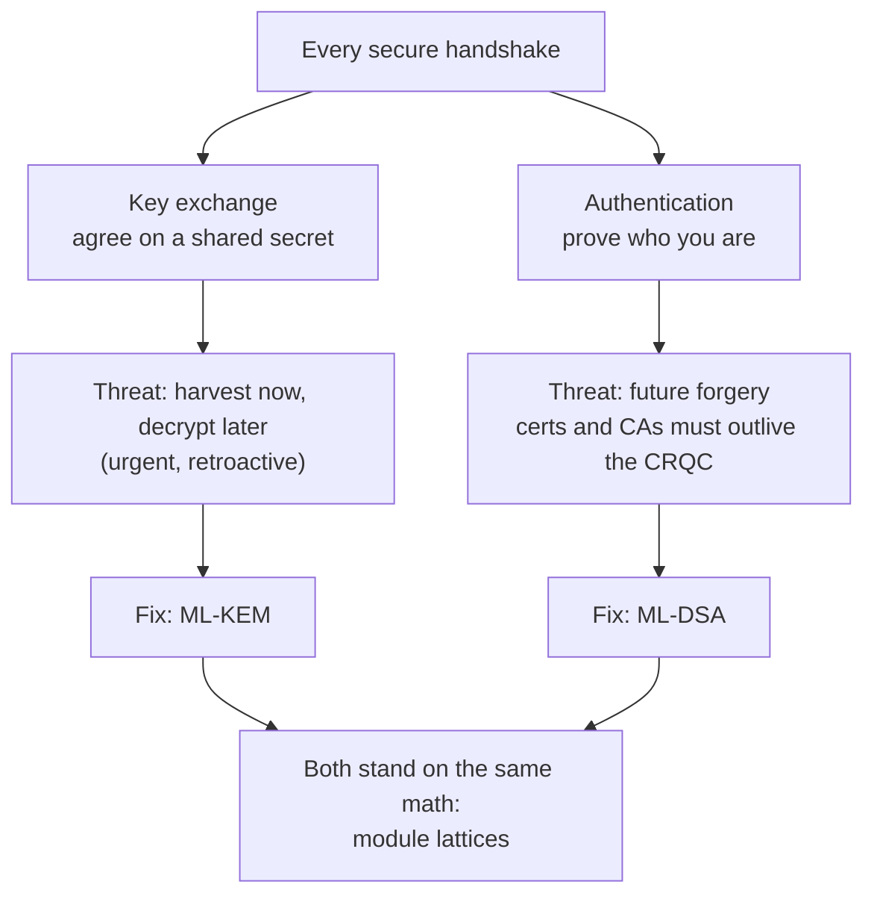

# Hands-on with Post-Quantum Cryptography for Network Infrastructure

Take the security protocols you already run (IPsec, TLS, MACsec, SSH) all the way to **post-quantum**, one piece of the handshake at a time. Spin up containers, capture real packets, and measure the trade-offs with your own eyes. Every secure handshake rests on two pillars a quantum computer threatens: **key exchange** (the shared secret, fixed by **ML-KEM**) and **authentication** (proving identity, fixed by **ML-DSA**). Each lab below takes a real protocol post-quantum.

---

## Recommended order

The labs build on each other: concepts introduced early (fragmentation, hybrid key exchange, the key-exchange-vs-authentication split) are assumed in later labs. Follow this progression:

| Protocol | What you learn |
|----------|----------------|
| [**IPsec / IKEv2 (Layer 3 VPNs)**](#ipsec--ikev2-layer-3-vpns) | Hybrid key exchange, IKE fragmentation, ML-DSA authentication |
| [**TLS 1.3 (the web's secure channel)**](#tls-13-the-webs-secure-channel) | Same hybrid, no extra round trip; mutual auth with ML-DSA certs |
| [**MACsec / 802.1X (Layer 2 link encryption)**](#macsec--8021x-layer-2-link-encryption) | EAP-TLS reuses the TLS handshake at Layer 2; silent downgrade risk |
| [**SSH (secure remote access)**](#ssh-secure-remote-access) | PQ key exchange on by default; **loud** downgrade; composite ML-DSA auth |
| [Module Lattices (bonus)](#module-lattices-bonus-lab-the-math-foundation) | Optional deep-dive into the math under ML-KEM and ML-DSA |

Each lab *can* be run standalone if you already know the earlier material, but if you're going through the repo for the first time, the order above gives the smoothest ramp.

---

## The labs

### IPsec / IKEv2 (Layer 3 VPNs)

Take a real IKEv2/IPsec VPN tunnel post-quantum.

- **[Key Exchange](ipsec/key-exchange/README.md)** (45 min, beginner):
  Negotiate a hybrid **DH + ML-KEM** key exchange over a real IKEv2 handshake, capture it, compare classical vs hybrid, reach quantum safety a different way with post-quantum preshared keys.

- **[Authentication](ipsec/authentication/README.md)** (45 min, intermediate):
  Generate **ML-DSA / SLH-DSA** keys and certificates, weigh the size explosion, then mutually authenticate an IKEv2 tunnel: classical ECDSA first, then post-quantum ML-DSA.

*Start with Key Exchange: it introduces the containers, strongSwan, and the hybrid handshake that the Authentication lab builds on.*

### TLS 1.3 (the web's secure channel)

Take TLS post-quantum, the protocol behind HTTPS and most application traffic.

- **[Key Exchange](tls/key-exchange/README.md)** (30 min, beginner):
  Run a real TLS 1.3 handshake that negotiates a hybrid **DH + ML-KEM** key exchange, capture it, and compare it to classical DH byte for byte. See why TLS needs **no extra round trip** for ML-KEM, unlike IKEv2.

- **[Authentication](tls/authentication/README.md)** (40 min, intermediate):
  Generate **ML-DSA** keys and certificates, weigh the size difference against classical **ECDSA**, then mutually authenticate a real TLS connection: ECDSA first, then post-quantum ML-DSA, and measure what the bigger certificates do to the handshake.

*Same two pillars as the IPsec family, this time at the application layer.*

### MACsec / 802.1X (Layer 2 link encryption)

Take MACsec post-quantum. Its entire quantum exposure lives in an EAP-TLS handshake.

- **[MACsec](macsec/README.md)** (50 min, intermediate):
  Trace MACsec's key hierarchy, run a real EAP-TLS handshake and prove in the captured bytes that it negotiates hybrid **DH + ML-KEM**; watch how easily it silently downgrades to classical TLS 1.2; then swap the certificates from classical ECDSA to post-quantum **ML-DSA** and measure the size cost as EAP fragments the handshake across 3-4x more EAPOL frames.

*Both pillars live in a **single** EAP-TLS handshake here, so this is one combined lab, at Layer 2 over a different control plane, a useful contrast for anyone running switching/access infrastructure.*

### SSH (secure remote access)

Take SSH post-quantum, the protocol behind remote shells, git, CI/CD deploys, and tunnels. Its key exchange is post-quantum **by default**, while its authentication is the piece still on the experimental frontier.

- **[SSH](ssh/README.md)** (45 min, intermediate):
  Watch a real SSH handshake negotiate hybrid **ML-KEM** with zero config, prove it in the cleartext bytes and measure its size cost, catch a downgrade being flagged out loud, then reissue the host and user keys as composite **Ed25519+ML-DSA-44** and authenticate both ends post-quantum.

*Both pillars live in one SSH handshake, so this is one combined lab where the key exchange is the easy, on-by-default half, and the authentication is the frontier.*

### Module Lattices (bonus lab: the math foundation)

- **[Module Lattices](module-lattices/README.md)** (60 min, beginner, no crypto-math required):
  Build a lattice from scratch, watch noise turn easy algebra into hard **LWE**, implement a baby **ML-KEM** over the real ring, then run a real lattice attack and watch its cost explode: the concrete reason a quantum computer can't break **ML-KEM or ML-DSA**.

*An optional deep-dive for when you want to understand the shared module-lattice foundation under both ML-KEM and ML-DSA, and why neither is breakable by a quantum computer.*

---

## The two pillars in detail

**Every secure connection rests on two independent jobs**, and a cryptographically relevant quantum computer (CRQC) threatens each in a different way:

- **Key exchange** decides the shared secret. It is vulnerable to *harvest now, decrypt later*: an attacker records your traffic today and decrypts it once a quantum computer arrives. This is the **urgent** one, because the damage is retroactive. The fix is **ML-KEM**.
- **Authentication** proves who is on the other end. Its deadline is sneakier: there is no retroactive forgery, but your long-lived certificates and CAs must still be trustworthy *after* a CRQC exists. The fix is **ML-DSA**.

Every lab above is about upgrading one of these two pillars. Once you see the pattern in one protocol, the others click fast.

---

## Prerequisites

These labs run entirely on **your own local workstation** (laptop or desktop): no cloud, no remote servers, no dedicated hardware. All you need installed is **Docker** with the Compose v2 plugin (the `docker compose` subcommand, not the old standalone `docker-compose`). Everything else (strongSwan, OpenSSL 3.5, wpa_supplicant/hostapd, OpenSSH, tcpdump, Python) lives inside throwaway containers, so you can run, break, and rerun the labs as many times as you like. A few of the images compile their star tool from source (strongSwan, wpa_supplicant/hostapd, or OpenSSH), so their *first* build takes a few minutes; after that everything is quick. Each lab's README has its own short Prerequisites and Build-and-start section.

**Do I need a quantum computer to run these labs?** No. 🙂 Everything runs on classical hardware in Docker. The labs demonstrate the *defenses* being deployed today against a future CRQC.

---

## A note on lab security

These are **labs**, not production templates. They deliberately keep authentication trivial where it's not the subject (the IKEv2 key-exchange lab uses a hardcoded throwaway PSK) and generate unencrypted keys for convenience. Never reuse the keys, certs, or PSKs here, and never commit secrets; the [.gitignore](.gitignore) already excludes the credentials the cert generators produce at runtime.

## License

Released under the terms in [LICENSE](LICENSE).