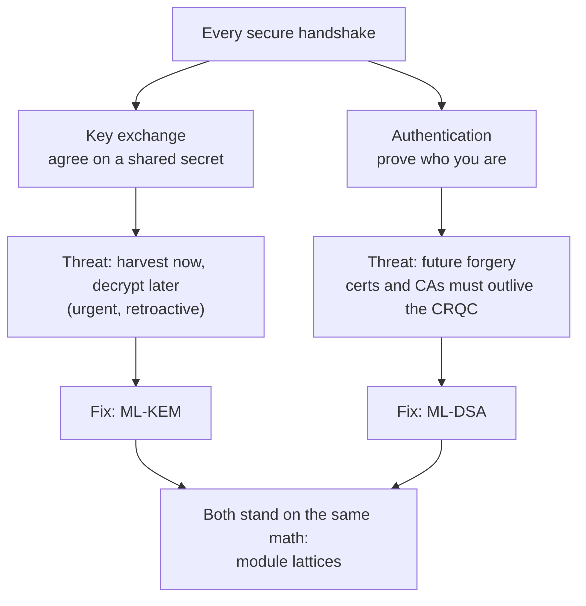

# Post-Quantum Cryptography for Network Infrastructure

**Learn it in containers. Deploy it on real gear.**

The security protocols you already run (IPsec, TLS, MACsec, SSH) all need to go
post-quantum, and that migration is happening now, one piece of the handshake at a time.
This repo takes you through it twice: first in throwaway containers on your laptop, where
you can capture the packets and break things for free, then on real Cisco routers, where
the same RFCs meet Cisco's CLI, licensing, and platform capabilities.

Two stages, in order:

- **[Stage 1 - Learn](learn/README.md)**: hands-on labs with containers and real packet captures. No hardware required, nothing to lose, break and rerun as often as you like.
- **[Stage 2 - Deploy](deploy/README.md)**: the same protocols on Cisco routers.

---

## The challenge

Before any lab, it's worth being precise about what a quantum computer actually breaks.
**Every secure connection rests on two independent jobs**, and a cryptographically
relevant quantum computer (CRQC) threatens each in a different way:

```mermaid
flowchart TD
    HS["Every secure handshake"] --> KE["Key exchange<br/>agree on a shared secret"]
    HS --> AUTH["Authentication<br/>prove who you are"]
    KE --> HNDL["Threat: harvest now, decrypt later<br/>(urgent, retroactive)"]
    AUTH --> FORGE["Threat: future forgery<br/>certs and CAs must outlive the CRQC"]
    HNDL --> MLKEM["Fix: ML-KEM"]
    FORGE --> MLDSA["Fix: ML-DSA"]
    MLKEM --> LAT["Both stand on the same math:<br/>module lattices"]
    MLDSA --> LAT
```

- **Key exchange** decides the shared secret. It is vulnerable to *harvest now, decrypt
  later*: an attacker records your traffic today and decrypts it once a quantum computer
  arrives. This is the **urgent** one, because the damage is retroactive. The fix is
  **ML-KEM** ([FIPS 203](https://csrc.nist.gov/pubs/fips/203/final)).
- **Authentication** proves who is on the other end. Its deadline is sneakier: there is no
  retroactive forgery, but your long-lived certificates and CAs must still be trustworthy
  *after* a CRQC exists. The fix is **ML-DSA**
  ([FIPS 204](https://csrc.nist.gov/pubs/fips/204/final)).

Every lab and every deployment doc in this repo is about upgrading one of these two
pillars. Once you see the pattern in one protocol, the others click fast.

---

## Stage 1 - Learn

Spin up containers, capture real packets, measure the trade-offs with your own eyes. Four
protocol families (IPsec, TLS, MACsec, SSH), each taken post-quantum one pillar at a time,
plus an optional deep-dive into the lattice math behind it all.

See [the full lab guide](learn/README.md) for the recommended order, timing, and details.

## Stage 2 - Deploy on Cisco hardware

Same protocols, same RFCs, on Cisco devices you use in your network. Every exercise also
has Ansible playbooks that push the same posture over NETCONF, with captured output from
real hardware runs if you want to read the automation path without running it.

See [the deploy guide](deploy/README.md) for the platforms covered and how to navigate the
docs without hardware.

## Important stuff

In Stage 1, every protocol goes
post-quantum, because the container images are built from the newest open-source software there is. Stage 2 is where you meet reality:

- **Release numbers are part of your design.** ML-DSA authentication for IKEv2 wasn't in
  IOS XE 26.1 and is in 26.2, so a migration plan written six months earlier had a gap in
  it that closed on a schedule you didn't control. Your plan has release numbers in it,
  not just algorithm names.
- **Shipping isn't the same as free.** ML-DSA-65 authentication works on 26.2, and it
  makes the IKEv2 handshake **six times bigger**: 7 frames and 7 KB becomes 20 frames and
  24 KB, measured on the wire. You only find that out by running it.
- **Not every surface moves at once.** The same box does ML-KEM for IPsec, SSH, MACsec and
  now its own HTTPS server, but ML-DSA only for IKEv2. "Does platform X support PQC?" is
  never a yes/no question.
- **Standards maturity sets the ceiling.** Composite ML-DSA SSH keys work in the lab
  because OpenSSH ships an experimental implementation of an internet draft. No vendor
  ships that in a supported release, and that's the correct call.

---

## Prerequisites

**Stage 1** runs entirely on **your own local workstation** (laptop or desktop): no cloud,
no remote servers, no dedicated hardware. All you need installed is **Docker**. Everything else lives inside throwaway containers, so you can run, break, and
rerun the labs as many times as you like. A few of the images compile their tooling from
source. Each lab's README has its own short Prerequisites
and Build-and-start section.

**Stage 2** needs real gear: three Cisco 8000 Series Secure Routers on IOS XE 26.2 with the
"advantage" license, wired back-to-back. No RADIUS or ISE needed, even for MACsec: one
router runs a local CA and IOS XE does the EAP-TLS itself. You can read Stage 2 without any
of it (the captured output and running configs are all in the repo).

**Do I need a quantum computer for any of this?** No. 🙂 Everything runs on classical
hardware. Both stages demonstrate the *defenses* being deployed today against a future
CRQC.

---

## A note on lab security

These are **labs**, not production templates. They deliberately keep authentication trivial
where it's not the subject (the IKEv2 key-exchange lab uses a hardcoded throwaway PSK) and
generate unencrypted keys for convenience. Every credential you see in Stage 2 (device
PSKs, the MACsec key string) is an example value, and the
captured device configs have their local credential hashes stripped. Never reuse any of it,
and never commit secrets; the [.gitignore](.gitignore) already excludes the credentials the
cert generators produce at runtime.

## License

Released under the terms in [LICENSE](LICENSE).
