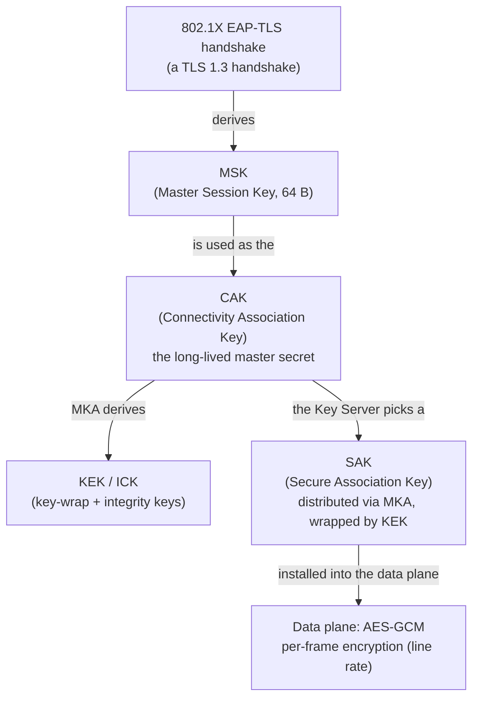

# A Hands-On Post-Quantum MACsec Lab

### Is your switch fabric ready for a quantum computer?

A lot of network encryption happens one layer below the VPN. **MACsec (IEEE 802.1AE)** encrypts Ethernet frames at **Layer 2**, one hop at a time: between switches, between a host and its access port, or across a data-center fabric or a 5G fronthaul link. So if you run network infrastructure, here is a fair question: is MACsec ready for a cryptographically relevant quantum computer, and if not, where does the post-quantum work go?

The answer is simpler than you might expect. MACsec's whole quantum story lives in **one place**: the **EAP-TLS** handshake that sets up its keys. That single handshake is where *both* halves of the post-quantum upgrade happen:

- **Key exchange** (secrecy): the classical (EC)DHE inside EAP-TLS becomes hybrid **ML-KEM** (`X25519MLKEM768`).
- **Authentication** (identity): the ECDSA/RSA certificates become post-quantum **ML-DSA**.

We find both the same way as in the other labs. We start containers **on your own workstation**, run a real EAP-TLS handshake between a supplicant and an authenticator, and capture the packets to see the post-quantum crypto for ourselves. The only tool you need installed is **Docker**.

Ready? Let's start.

---

## Contents

1. [What are we trying to figure out?](#what-are-we-trying-to-figure-out)
2. [Why should you care? MACsec and Layer 2](#why-should-you-care-macsec-and-layer-2)
3. [Where does MACsec get its keys? MKA, CAK, and the key hierarchy](#where-does-macsec-get-its-keys-mka-cak-and-the-key-hierarchy)
4. [Where's the quantum risk? (Not where you'd think)](#wheres-the-quantum-risk-not-where-youd-think)
5. [The post-quantum pieces: ML-KEM and ML-DSA in EAP-TLS](#the-post-quantum-pieces-ml-kem-and-ml-dsa-in-eap-tls)
6. [Our tools of choice: wpa_supplicant, hostapd, and OpenSSL 3.5](#our-tools-of-choice-wpa_supplicant-hostapd-and-openssl-35)
7. [Let's get our hands dirty: the lab](#lets-get-our-hands-dirty-the-lab)

---

## What are we trying to figure out?

One question drives this lab: **when MACsec goes post-quantum, what part of it actually changes?**

You might guess the answer is "the encryption". It is not. MACsec's frame encryption is **AES-GCM**, a symmetric cipher that is already considered quantum-resistant (Grover's algorithm only halves its effective key strength, so AES-256-GCM keeps a comfortable ~128-bit quantum security margin). The quantum-vulnerable part of MACsec is somewhere else: in **how the keys are established, and how the peers prove who they are**, before any frame is encrypted. Both of these happen in the EAP-TLS handshake.

By the end of this lab you will have seen, in your own packets:

- **The key hierarchy:** how a MACsec link goes from two devices that share nothing to two peers that share an encryption key, through 802.1X, EAP-TLS, MKA, the CAK, and finally the SAK.
- **Where the quantum risk lives:** why the data plane is already safe, and why the *EAP-TLS handshake* is the part that needs both ML-KEM and ML-DSA.
- **The hybrid key exchange on the wire:** a real EAP-TLS exchange negotiating `X25519MLKEM768`, captured and decoded.
- **A silent downgrade:** how easy it is to *think* you are post-quantum while quietly falling back to a classical TLS 1.2 handshake, and how to prove whether you did.
- **Post-quantum authentication:** swap the EAP-TLS certificates from classical ECDSA to **ML-DSA**, and see the certificate-size cost as EAP splits the handshake across 3-4x more EAPOL frames.

---

## Why should you care? MACsec and Layer 2

First, some background. **MACsec** ([IEEE 802.1AE](https://1.ieee802.org/security/802-1ae/)) is link-layer encryption for Ethernet. Where IPsec protects IP packets end to end at Layer 3, MACsec protects *frames* at Layer 2, on a single hop: switch-to-switch, host-to-switch, or across a provider's Carrier Ethernet. It encrypts and integrity-protects the whole frame payload with **AES-GCM**.

Where does it show up in real infrastructure?

- **Enterprise access:** a laptop authenticating to a switch port with 802.1X, then encrypting everything on that port.
- **Data-center and campus fabrics:** switch-to-switch links encrypted so a tap in the wiring closet sees only ciphertext.
- **Service-provider and 5G transport:** MACsec is widely used to protect fronthaul/backhaul and Carrier Ethernet links.

MACsec is interesting for a post-quantum discussion for one reason: it splits cleanly into two planes.

- **The data plane** does the per-frame AES-GCM encryption in hardware at line rate, using a key called the **SAK** (Secure Association Key).
- **The control plane** decides *who* is allowed on the link and *how the peers agree on the keys*. This is where 802.1X, EAP, and **MKA** (MACsec Key Agreement) live.

The data plane uses symmetric crypto, so it is already quantum-safe. Any quantum problem in MACsec must therefore be in the control plane: in how the keys are agreed and how identities are proven. That is what we look at next.

---

## Where does MACsec get its keys? MKA, CAK, and the key hierarchy

A MACsec link does not simply "have a key". It builds one through a chain of steps.



Reading it from the top:

1. **802.1X / EAP-TLS.** When a supplicant (the endpoint) connects to an authenticator (the switch port), they run an **EAP-TLS** exchange: a full TLS 1.3 handshake carried inside 802.1X **EAPOL** frames. Both sides authenticate with certificates, and the handshake produces shared key material.
2. **MSK.** That handshake derives a 64-byte **Master Session Key**. This is the single secret that everything else is derived from.
3. **CAK.** The MSK becomes the **Connectivity Association Key**, the long-lived master secret for the link (in EAP mode it is derived from the MSK; it can also be a static pre-shared key).
4. **KEK / ICK and the SAK.** MKA uses the CAK to derive key-wrap and integrity keys, then the elected Key Server generates the **SAK** and distributes it (wrapped) to every peer.
5. **Data plane.** The SAK is installed into the hardware, which AES-GCM-encrypts every frame at line rate.

Everything from the CAK down is symmetric-key derivation (AES-CMAC based KDFs), which quantum computers do not meaningfully threaten. So the security of the whole chain depends on the very first step: the EAP-TLS handshake.

---

## Where's the quantum risk? (Not where you'd think)

Now we can answer the question precisely. Go through the chain step by step and ask, at each step, "does a quantum computer break this?"

- The **data plane** (AES-GCM) is quantum-safe. Leave it alone.
- The **SAK / KEK / ICK** are all derived from the CAK with symmetric KDFs. Quantum-safe.
- The **CAK** comes from the **MSK**, which comes from the **EAP-TLS handshake**.

That last step is where the quantum risk concentrates, so it is worth being clear about what happens inside it. The EAP-TLS handshake is a TLS 1.3 handshake, and a TLS handshake does two separate cryptographic jobs at once:

- a **key exchange**, where the two sides run (EC)DHE to agree on a shared secret (this is what the MSK is derived from), and
- an **authentication** step, where each side proves its identity by signing the handshake with the private key behind its certificate (ECDSA or RSA), and the other side verifies that signature against the certificate.

Both jobs rely on public-key cryptography, and public-key cryptography is exactly what Shor's algorithm breaks. So both pieces are quantum-vulnerable and live in that one handshake. They are the two classic halves of cryptography, and a quantum computer breaks each one in a different way:

| | Key exchange | Authentication |
|-|--------------|----------------|
| Classical primitive in EAP-TLS | (EC)DHE | ECDSA / RSA signatures |
| Broken by | Shor's algorithm | Shor's algorithm |
| Threat timing | **Harvest now, decrypt later** | **Must break *during* the session** |
| Urgency | High (recorded today, broken later) | Lower (no forging the past) |
| Post-quantum fix | hybrid ML-KEM (`X25519MLKEM768`) | ML-DSA certificates |

This timing difference is the key point.

- **Key exchange has a retroactive problem.** The key exchange in classical EAP-TLS is **(EC)DHE**, exactly the Diffie-Hellman that Shor's algorithm breaks. This is the same **harvest now, decrypt later** problem, now one layer down. An attacker who records a MACsec link's EAP-TLS handshake today can, with a future quantum computer, recover the DHE secret. From there they follow the chain from MSK to CAK to SAK and decrypt all the AES-GCM frames they captured alongside it. That is why ML-KEM is the more urgent migration.
- **Authentication does not.** A signature only has to be unforgeable *at the moment of the handshake*. Breaking ECDSA in 2035 does not let you impersonate someone in a session that completed in 2025: the session is over, so there is nothing to steal. The risk is purely forward-looking. Once large quantum computers exist, *future* authentications that use ECDSA become forgeable, and long-lived CA hierarchies are exactly what you do not want to reissue in a hurry.

So the post-quantum fix for MACsec is **not** a new cipher for the data plane. It is making the **EAP-TLS handshake** quantum-safe in both halves: **hybrid ML-KEM** for the key exchange and **ML-DSA** for the certificates. And because EAP-TLS *is* a TLS 1.3 handshake, we already know how to do both: it is exactly the post-quantum handshake from the [TLS lab](../tls/key-exchange/README.md), now carried inside EAPOL at Layer 2.

> **One thing to remember:** MACsec's encryption is already quantum-safe. Its *key establishment and authentication* are not, and the whole post-quantum upgrade happens inside the EAP-TLS handshake that sets up the CAK.

---

## The post-quantum pieces: ML-KEM and ML-DSA in EAP-TLS

EAP-TLS ([RFC 9190](https://www.rfc-editor.org/rfc/rfc9190) brings it to TLS 1.3) runs an ordinary TLS 1.3 handshake, so making it post-quantum means changing two independent settings, both provided by OpenSSL 3.5.

### Half 1: the key exchange (hybrid ML-KEM)

In TLS 1.3 the key exchange is negotiated as a **named group** in the `supported_groups` extension, and the actual keys are exchanged in `key_share`. A classical handshake offers groups like `x25519` or `secp256r1`. A post-quantum one offers **`X25519MLKEM768`**: a hybrid that runs classical X25519 **and** post-quantum ML-KEM-768 together and feeds *both* shared secrets into the TLS key schedule (you saw this exact group negotiated in a plain TLS 1.3 handshake in the [TLS key-exchange lab](../tls/key-exchange/README.md); the [IKEv2 key-exchange lab](../ipsec/key-exchange/README.md) explains the hybrid *why* in depth):

- **X25519** is fast and well-tested but falls to Shor's algorithm.
- **ML-KEM-768** ([FIPS 203](https://csrc.nist.gov/pubs/fips/203/final)) has no known quantum attack but is newer and less field-tested.
- **`X25519MLKEM768`** combines them, so an attacker must break *both*. If either one holds, the session is safe.

There is one useful difference from IKEv2. IKEv2 needed a whole new round trip (`IKE_INTERMEDIATE`, RFC 9370) to carry ML-KEM's large payloads. TLS 1.3 does not: the hybrid key share rides in the **same ClientHello/ServerHello** as a classical one would. ML-KEM-768's ~1.2 KB client key share simply makes those handshake messages bigger, which, as you will see, is what forces EAP to split them across many EAPOL frames.

| | X25519 | ML-KEM-768 | `X25519MLKEM768` (hybrid) |
|-|--------|-----------|---------------------------|
| Client key share | 32 B | 1184 B | **1216 B** (32 + 1184) |
| Server key share | 32 B | 1088 B | **1120 B** (32 + 1088) |
| Quantum-safe | no | yes | yes |
| TLS 1.3 group ID | `0x001d` | `0x0200`* | `0x11ec` |

\* pure ML-KEM groups exist but hybrids are the recommended deployment; we use the hybrid.

You will see every one of those byte counts in the capture in [Exercise 2](#exercise-2-prove-the-key-exchange-is-post-quantum).

### Half 2: the authentication (ML-DSA certificates)

EAP-TLS authentication is ordinary TLS 1.3 certificate authentication, so making it post-quantum means two things:

1. **The certificates are signed with ML-DSA** instead of ECDSA: the CA signs leaf certs with an ML-DSA key, and the leaf certs carry ML-DSA public keys.
2. **The handshake `CertificateVerify` uses ML-DSA**: each peer signs the transcript with its ML-DSA private key, and the other side verifies with the ML-DSA public key from the cert.

ML-DSA ([FIPS 204](https://csrc.nist.gov/pubs/fips/204/final)) is a lattice-based signature scheme with no known quantum attack. It comes in three sizes (ML-DSA-44, -65, and -87), trading size for security margin. Its main practical feature is its **size**: ML-DSA keys and signatures are much larger than ECDSA's, and that shows up in everything that has to carry a certificate.

Here is what that looks like in *this lab's actual certificates* (measured with `openssl x509 ... -outform DER | wc -c`):

| Cert signature algorithm | Leaf cert size (DER) | vs ECDSA |
|--------------------------|----------------------|----------|
| `ecdsa-with-SHA256` (P-256) | 483 B | 1x |
| `ML-DSA-44` | 4080 B | ~8.5x |
| `ML-DSA-65` | 5609 B | ~11.6x |

In a normal HTTPS connection a few extra kilobytes is nothing. But EAP-TLS does not run over TCP. It runs over **EAPOL**, 802.1X's Layer 2 carrier, and EAP has a small MTU. Large handshake messages must be **fragmented** across many EAPOL frames and reassembled. That makes the certificate-size cost unusually *visible* here, which is exactly why this lab is a good place to see it. You will measure it directly in [Exercise 3](#exercise-3-make-authentication-post-quantum-ml-dsa).

> **Why ML-KEM and ML-DSA are quantum-safe.** Both are built on module lattices. The companion [module-lattices lab](../module-lattices/README.md) builds that math from the ground up and runs a real attack against the lattice problem that protects them.

---

## Our tools of choice: wpa_supplicant, hostapd, and OpenSSL 3.5

The IKEv2 labs used strongSwan because it speaks IKEv2. MACsec uses a completely different control plane (802.1X / EAP / MKA), so we use the standard open-source tools for it:

- **[wpa_supplicant](https://w1.fi/wpa_supplicant/)** is the **supplicant**: the endpoint side of 802.1X. It runs the EAP-TLS peer and the MKA state machine.
- **[hostapd](https://w1.fi/hostapd/)** is the **authenticator**: the switch-port side. We use its **integrated EAP-TLS server** so the whole lab is self-contained (no external RADIUS server needed).
- **[OpenSSL 3.5+](https://openssl-library.org/)** provides the TLS 1.3 crypto with *both* post-quantum algorithms: ML-KEM groups and ML-DSA signatures.

Both wpa_supplicant and hostapd are compiled from source. Why from source rather than the distro package? Because **EAP-TLS over TLS 1.3 is disabled by default**, on *both* ends, and the stock packages do not turn it on:

- wpa_supplicant disables TLS 1.3 for EAP-TLS unless built with **`CONFIG_EAP_TLSV1_3=y`** (a build-time flag). The Debian package is not built with it, so it caps EAP-TLS at TLS 1.2, and **without TLS 1.3 there is no ML-KEM** (and no ML-DSA certificate auth either).
- hostapd's EAP server *also* disables TLS 1.3 by default (`TLS_CONN_DISABLE_TLSv1_3` in its config defaults); it has to be turned back on with **`tls_flags=[ENABLE-TLSv1.3]`** in `hostapd.conf`.

These two gates are the single most important practical pitfall in post-quantum MACsec today, and the lab is built to make them impossible to miss ([Exercise 2](#exercise-2-prove-the-key-exchange-is-post-quantum) deliberately removes the override and shows the handshake silently downgrade). It is the same point as the IKEv2 authentication lab's "frontier" caveat: the cryptography is ready in OpenSSL, but the protocol support around it is still catching up.

> **One image, both algorithms.** Unlike the IKEv2 [authentication lab](../ipsec/authentication/README.md), which needs a separate strongSwan build to add PQC signature support, here everything is native to OpenSSL 3.5. Switching the key exchange to hybrid ML-KEM is automatic once TLS 1.3 is on, and switching authentication from classical to post-quantum is *just reissuing the certificates*, with no image rebuild and no config change. That is a good preview of where the ecosystem is heading.

> **Why not strongSwan here?** strongSwan is an IKEv2 implementation, so it does not do 802.1X/MACsec. OpenSSL has the PQC crypto, but it is not an EAP/802.1X implementation either. wpa_supplicant and hostapd are the tools that actually speak the MACsec control plane, and they link OpenSSL 3.5 for the TLS underneath, so we get the post-quantum group and signatures automatically, once the gates above are open.

---

## Let's get our hands dirty: the lab

Here is the plan. We run **one** EAP-TLS handshake and examine its two independent halves, key exchange and authentication, one at a time. But before we start, it is worth being clear about where each half begins, because the two are *not* in the same state at the baseline:

- **The key exchange is post-quantum from the very first run.** Once TLS 1.3 is enabled on both ends (the two gates from the previous section), OpenSSL 3.5 negotiates hybrid `X25519MLKEM768` *by default*. Nothing extra to turn on. So even the "baseline" handshake in Exercise 1 already derives its MSK from ML-KEM; we simply do not *prove* it until Exercise 2.
- **The authentication starts classical.** We deliberately begin with **ECDSA** certificates, so the *identity* half is still quantum-vulnerable at the baseline. Exercise 3 is where we upgrade it to **ML-DSA**.

So the order is *not* "start fully classical, then make everything post-quantum". Instead: the key exchange is already post-quantum from the start (Exercise 2 proves it in the bytes, and shows how easily a misconfiguration loses it), while the authentication is the one piece we switch over ourselves (Exercise 3). Keep that split in mind as you read each exercise:

- **[Exercise 1](#exercise-1-run-the-eap-tls-handshake-ecdsa-baseline)**: run a real EAP-TLS handshake between a supplicant and an authenticator with the classical **ECDSA** certs, watch it derive the key material that roots the MACsec CAK, and record a baseline frame count. (Its key exchange is *already* hybrid ML-KEM; only its authentication is still classical.)
- **[Exercise 2](#exercise-2-prove-the-key-exchange-is-post-quantum)**: capture that same handshake and prove, in the bytes, that its key exchange negotiated hybrid `X25519MLKEM768`, then remove the TLS 1.3 override and watch it silently downgrade to classical crypto.
- **[Exercise 3](#exercise-3-make-authentication-post-quantum-ml-dsa)**: reissue the certificates as **ML-DSA**, run the same handshake, confirm the *authentication* is now genuinely post-quantum, and measure the EAPOL fragmentation cost.

### How the topology works

We will have two containers, exactly like in the IKEv2 labs' initiator/responder:

- **`macsec-authenticator`**: the "switch port", runs hostapd with the integrated EAP-TLS server.
- **`macsec-supplicant`**: the "endpoint", runs wpa_supplicant as the EAP-TLS peer.

They are joined by a **veth pair** (a virtual Ethernet "cable"): `aut` on the authenticator end, `sup` on the supplicant end. To make that direct L2 link work on plain Docker, the supplicant container shares the authenticator's network namespace (`network_mode: service:macsec-authenticator` in the compose file). Why not a normal Docker bridge network? Because 802.1X EAPOL frames are sent to the **PAE group multicast address** `01:80:c2:00:00:03`, which Linux bridges filter out by default. A point-to-point veth delivers them unfiltered, so the lab needs no host-side configuration.

> **What is the "PAE group address"?** A *PAE* (Port Access Entity) is the 802.1X software on each port that runs the authentication state machine: the supplicant on one side, the authenticator on the other. Instead of addressing each other by MAC, the two PAEs talk over a fixed IEEE-reserved Layer 2 multicast address, `01:80:c2:00:00:03`, called the **PAE group address**. It is a well-known "everyone doing 802.1X on this link, listen here" address, so a device can start EAPOL before it knows anything about its neighbour (or even has an IP). 

### Prerequisites

**Docker** with the Compose v2 plugin (`docker compose ...`), and three terminals: two for the container shells (authenticator and supplicant) and one on your host for `docker compose` commands like reissuing certificates. Everything the handshake needs, wpa_supplicant, hostapd, OpenSSL 3.5, `tcpdump`, and `tshark`, is compiled into the image. One caveat to know going in: this lab exercises the EAP-TLS *handshake*, which runs on any Docker host, but actually encrypting frames with the kernel MACsec driver needs a kernel built with `CONFIG_MACSEC` (Docker Desktop's LinuxKit kernel doesn't have it), so the data plane itself is out of scope, see [A note on the data plane](#a-note-on-the-data-plane) at the end for how you'd drive it on a Linux host.

### Build and start

Everything runs **locally on your workstation**. Clone the repo and run all commands from the `macsec/` directory:

```bash
cd macsec
```

```bash
# Build the image (first run compiles wpa_supplicant + hostapd from source, ~1-2 min)
docker compose build

# Mint the lab CA + EAP server/supplicant certificates (classical ECDSA to start)
docker compose run --rm certgen ecdsa

# Start both roles
docker compose up -d

# Verify both are up (authenticator shows healthy once the veth link is created)
docker compose ps
```

Expected:
```
NAME                   STATUS
macsec-authenticator   Up (healthy)
macsec-supplicant      Up
```

The `certgen` step builds a small CA and issues two certificates: a `serverAuth` cert for the authenticator's EAP server and a `clientAuth` cert for the supplicant, installing each into the right config directory. We start with classical **ECDSA** so the *authentication* half has a clean classical baseline (remember: the *key exchange* is already hybrid ML-KEM by default); [Exercise 3](#exercise-3-make-authentication-post-quantum-ml-dsa) reissues these as post-quantum ML-DSA with a single command.

---

### Exercise 1: Run the EAP-TLS handshake (ECDSA baseline)

We start the authenticator's EAP server, then run the supplicant and watch it authenticate and derive keys.

**Step 1: Start the authenticator (hostapd EAP server)**

Open a shell on the authenticator and start hostapd in the foreground. The `-dd` debug output is very verbose, so we pipe it through `tee` to also save a copy in `/tmp/h.log`. We grep that copy for the few lines that matter, instead of scrolling through everything:

```bash
docker exec -it macsec-authenticator bash
hostapd -dd /cfg/hostapd.conf 2>&1 | tee /tmp/h.log
```

It loads the server certificate and waits for a supplicant. Leave this running and open a **second terminal** for the supplicant.

**Step 2: Run the supplicant (wpa_supplicant EAP-TLS peer)**

```bash
docker exec -it macsec-supplicant bash
wpa_supplicant -dd -Dwired -isup -c /cfg/wpa_supplicant.conf 2>&1 | tee /tmp/w.log
```

`-Dwired` selects the wired 802.1X driver, `-isup` binds to the supplicant end of the veth, and (as on the authenticator) `tee` saves the verbose stream to `/tmp/w.log`. Give it a second or two, until `CTRL-EVENT-EAP-SUCCESS` scrolls past, then **Ctrl-C both** `wpa_supplicant` (this terminal) and `hostapd` (the first terminal). Now, instead of scrolling back through hundreds of debug lines, pull out just the milestones with `grep`.

In the **supplicant** shell, look at the client's view of the handshake: the method, the TLS version, and the derived key material:

```bash
grep -aE 'CTRL-EVENT-EAP-METHOD|Using TLS version TLSv1.3|Derived key|Derived Session-Id|CTRL-EVENT-EAP-SUCCESS|CTRL-EVENT-CONNECTED' /tmp/w.log | uniq
```

```
sup: CTRL-EVENT-EAP-METHOD EAP vendor 0 method 13 (TLS) selected
SSL: Using TLS version TLSv1.3
EAP-TLS: Derived key - hexdump(len=64): [REMOVED]
EAP-TLS: Derived Session-Id - hexdump(len=65): 0d db 69 2c ...
sup: CTRL-EVENT-EAP-SUCCESS EAP authentication completed successfully
sup: CTRL-EVENT-CONNECTED - Connection to 01:80:c2:00:00:03 completed [id=0 id_str=]
```

In the **authenticator** shell, look at its own job: validating the client's certificate chain against the lab CA and opening the port:

```bash
grep -aE 'peer certificate: depth|remote certificate verification|: authorizing port' /tmp/h.log
```

```
authsrv: peer certificate: depth=1 ... subject=/C=US/O=PQC Lab/CN=PQC Lab CA
authsrv: peer certificate: depth=0 ... subject=/C=US/O=PQC Lab/CN=client.pqc.lab
authsrv: remote certificate verification success
aut: STA ... IEEE 802.1X: authorizing port
```

Three things just happened:

- **`method 13 (TLS)`**: the supplicant authenticated with EAP-TLS, and its certificate chain validated against the lab CA.
- **`Using TLS version TLSv1.3`**: the handshake ran on TLS 1.3 (the supplicant grep shows it; the authenticator negotiated the same version). This is the gate from earlier doing its job; in Exercise 2 you will see what happens without it. 
- **`EAP-TLS: Derived key (len=64)`**: that 64-byte value is the **MSK**. This is the exact key material that, in a full MACsec deployment, becomes the **CAK** that MKA uses to derive the SAK. You are watching the root of the MACsec key hierarchy being created from a real EAP-TLS handshake. As described in the plan, this baseline handshake is already split in two: its *secrecy* comes from a hybrid ML-KEM key exchange (we prove that in [Exercise 2](#exercise-2-prove-the-key-exchange-is-post-quantum)), while its *authentication* is still classical ECDSA (we upgrade that in [Exercise 3](#exercise-3-make-authentication-post-quantum-ml-dsa)).

The supplicant "connecting to `01:80:c2:00:00:03`" is it talking to the PAE group address. This confirms the exchange is real 802.1X over Layer 2, not an IP conversation.

**Step 3: Record the baseline frame count.** This is the number [Exercise 3](#exercise-3-make-authentication-post-quantum-ml-dsa) compares against. The capture and the handshake happen in **two different shells**, and the one thing that matters is that the handshake runs *while* the capture is live. First, if hostapd or the supplicant are still running from Steps 1-2, stop them (Ctrl-C).

In the **authenticator** shell, start the capture and the EAP server in the background:

```bash
# authenticator: capture EAPOL (ether proto 0x888e) on the veth link, save the PID
tcpdump -i aut -w /tmp/ecdsa.pcap -U 'ether proto 0x888e' &
TCPDUMP_PID=$!

# authenticator: start the EAP server in the background
hostapd -dd /cfg/hostapd.conf > /tmp/h.log 2>&1 &
```

Now run **exactly one** handshake against it, in the **supplicant** shell (the `macsec-supplicant` container shell from Exercise 1 Step 2; open one with `docker exec -it macsec-supplicant bash` if you do not already have it). Give it a few seconds to complete:

```bash
# supplicant container: clear any leftover supplicant, then run one handshake
pkill wpa_supplicant 2>/dev/null; rm -f /run/wpa/sup
wpa_supplicant -Dwired -isup -c /cfg/wpa_supplicant.conf -t -dd > /tmp/w.log 2>&1 &
sleep 5
```

Back in the **authenticator** shell, stop the capture and count the frames:

```bash
kill $TCPDUMP_PID
tshark -r /tmp/ecdsa.pcap 2>/dev/null | wc -l
```

With ECDSA certs the whole exchange is compact:

```
14
```

**14 EAPOL frames**, and the client certificate is **483 bytes**.

You can also count how many times the *client* had to **fragment** its outgoing TLS data; this is the number [Exercise 3](#exercise-3-make-authentication-post-quantum-ml-dsa) makes grow. The handshake logged to `/tmp/w.log`, so in the **supplicant** shell:

```bash
# supplicant container
grep -ac "more fragments will follow" /tmp/w.log
```

```
1
```

Just **one**. It is worth to be precise here, because "14 frames" and "1 fragment" count *completely different things*, and it is easy to assume they are measuring the same thing:

- An **EAPOL frame** is *one packet on the wire*. The **14** is the whole authentication exchange end to end: the EAPOL-Start, the identity request/response, the EAP-TLS start, then the TLS handshake flights (ClientHello; ServerHello + server certificate; client certificate; the Finished messages), and finally EAP-Success. Nearly all of these happen in *every* EAP-TLS handshake, whether or not anything is fragmented; they are just the protocol's normal exchange. EAP is strictly step-by-step, one request then one response at a time, so each flight is at least a request **and** a response.
- **Fragmentation** is a *different* measure entirely. It happens only when a *single* TLS message is too big to fit in one EAP packet, so it is split across several packets (every non-final piece flagged `more fragments will follow`, and each piece separately acknowledged). The **1** means exactly one TLS message had to be split.

So "1 fragment but 14 frames" is not a contradiction. Most of those frames are just the ordinary EAP-TLS exchange that would happen even with *zero* fragmentation, and only **one** message here was large enough to need splitting. Fragmentation *adds* frames on top (each extra fragment is another packet plus its ACK), but it is not what creates most of them. (This is the relationship Exercise 3 relies on: growing the certificate increases the *fragments*, which in turn increases the *frame* count, but the two never grow one-for-one.)

And it is worth knowing *why* that one split happens. It is the **ClientHello** being split to carry the 1216-byte hybrid ML-KEM key share, *not* the certificate (the 483-byte ECDSA cert fits comfortably in one EAP message). So even the classical baseline already fragments once, because of the post-quantum *key exchange*.

Keep all three numbers in mind (**14 frames**, **483-byte cert**, **1 client fragment**); Exercise 3 compares against them.

Stop hostapd with `pkill hostapd` once you have seen the success (here it is running in the **background**, so Ctrl-C will not reach it). Leave the containers up for Exercise 2.

---

### Exercise 2: Prove the key exchange is post-quantum

EAP success alone does not prove ML-KEM was used: a classical TLS 1.2 handshake would *also* report success. The only way to be sure is to look at the bytes. We capture the EAPOL traffic and decode the TLS handshake inside it.

**Step 1: Capture and run the handshake**

On the authenticator, capture EAPOL frames (`ether proto 0x888e` is EAPOL) while a handshake runs. The image includes `tshark` so we can decode the TLS inside EAP.

> **Shortcut:** this step re-captures into the same `/tmp/ecdsa.pcap` you made in [Exercise 1 Step 3](#exercise-1-run-the-eap-tls-handshake-ecdsa-baseline) (deliberately the same filename: it is the *same* ECDSA handshake, and it already contains everything Step 2 decodes). If that file still has frames (check with `tcpdump -r /tmp/ecdsa.pcap | wc -l`), you can **skip straight to Step 2**. Only re-capture with the rest of Step 1 below if you skipped Exercise 1 Step 3 or restarted the containers (a restart wipes `/tmp`).

First, clear out anything left running from Exercise 1; this matters. A `wpa_supplicant` that is still running from a previous step is *already authenticated* and just sits idle, so it produces **no new handshake**. A second stray `hostapd` competes for the port. Either way, your capture comes back with **0 packets**. Stop leftovers on both ends:

```bash
# in the authenticator container
pkill hostapd; pkill tcpdump
# in the supplicant container
pkill wpa_supplicant; rm -f /run/wpa/sup
```

Then, in the **authenticator** shell, start the capture and the EAP server:

```bash
# start capture in the background (same filename as Exercise 1's baseline)
tcpdump -i aut -w /tmp/ecdsa.pcap -U 'ether proto 0x888e' &
TCPDUMP_PID=$!

# start the EAP server in the background
hostapd -dd /cfg/hostapd.conf > /tmp/h.log 2>&1 &
```

Then in the **supplicant** shell (inside the `macsec-supplicant` container; open one with `docker exec -it macsec-supplicant bash` if needed), run one handshake:

```bash
# supplicant container
wpa_supplicant -Dwired -isup -c /cfg/wpa_supplicant.conf -t -dd > /tmp/w.log 2>&1 &
sleep 5
```

Back on the authenticator, stop the capture:

```bash
kill $TCPDUMP_PID
```

**Step 2: Decode the negotiated group**

Run these decodes in the **authenticator** shell; that is where `tcpdump` wrote `/tmp/ecdsa.pcap`.

First, what the client *offered* (the ClientHello `supported_groups`):

```bash
tshark -r /tmp/ecdsa.pcap -V 2>/dev/null \
  | awk '/Handshake Type: Client Hello/{f=1} /Handshake Type: Server Hello/{f=0} f' \
  | grep -i "Supported Group:"
```

```
Supported Group: X25519MLKEM768 (0x11ec)    ← post-quantum hybrid, offered FIRST
Supported Group: x25519 (0x001d)
Supported Group: secp256r1 (0x0017)
Supported Group: x448 (0x001e)
...
```

Now the part that settles it: what the server actually *selected* (the ServerHello):

```bash
tshark -r /tmp/ecdsa.pcap -V 2>/dev/null \
  | awk '/Handshake Type: Server Hello/{f=1} f' \
  | grep -iE "Supported Version: TLS 1.3|Cipher Suite:|Key Share Entry: Group:" | head -3
```

```
Cipher Suite: TLS_AES_256_GCM_SHA384 (0x1302)
Supported Version: TLS 1.3 (0x0304)
Key Share Entry: Group: X25519MLKEM768, Key Exchange length: 1120
```

**That is the proof.** The server did not just *accept* a post-quantum offer; it put `X25519MLKEM768` in its own `key_share`, with a **1120-byte** server key share (32 B X25519 + 1088 B ML-KEM-768 ciphertext, exactly the table from earlier). The TLS 1.3 session that produces the MACsec MSK is genuinely using hybrid ML-KEM.

For the other half of the table, decode the *client's* key share from the ClientHello (again in the **authenticator** shell):

```bash
tshark -r /tmp/ecdsa.pcap -V 2>/dev/null \
  | awk '/Handshake Type: Client Hello/{f=1} /Handshake Type: Server Hello/{f=0} f' \
  | grep -i "Key Share Entry: Group:"
```

```
Key Share Entry: Group: X25519MLKEM768, Key Exchange length: 1216
Key Share Entry: Group: x25519, Key Exchange length: 32
```

The client's `X25519MLKEM768` key share is **1216 bytes** (32 B X25519 + 1184 B ML-KEM-768 encapsulation key), the counterpart to the server's 1120-byte share above. (The extra `x25519` entry at 32 B is the classical fallback the client also offers, in case the server cannot do the hybrid group.)

**Step 3: Remove the gate, and watch the silent downgrade**

Hybrid ML-KEM only happens if the EAP-TLS handshake runs **TLS 1.3**, and TLS 1.3 is only used when *both* ends allow it. TLS always negotiates the **highest version both sides support**, so the effective limit is whichever end sets the *lower* ceiling. The dangerous case is when one end quietly drops its ceiling to TLS 1.2 while the other is still willing to speak 1.2. The handshake then negotiates down to classical crypto, loses ML-KEM entirely, and **still reports `EAP-SUCCESS`**. No error is shown.

The simplest way to trigger that is on the **authenticator** (the EAP server). Its `hostapd.conf` pins the handshake to TLS 1.3 with:

```
tls_flags=[ENABLE-TLSv1.3][DISABLE-TLSv1.0][DISABLE-TLSv1.1][DISABLE-TLSv1.2]
```

`hostapd` **disables TLS 1.3 by default**, so removing that line drops the server back to a TLS 1.2 ceiling. From the **authenticator** shell you already have open, comment the line out. The supplicant stays exactly as it is: it still offers 1.3, but it will also accept 1.2.

```bash
sed -i 's/^tls_flags=/#tls_flags=/' /cfg/hostapd.conf
```

Now capture a **fresh** handshake against the loosened server. This is the same three-shell capture flow as Step 1, just writing to `/tmp/down.pcap`. As always, the handshake must run *while* the capture is live (edit config -> capture -> handshake -> stop capture -> decode). Do not skip this and read the old pcap: you will get empty output.

In the **authenticator** shell (where you just edited the config), stop any leftover `hostapd`/`tcpdump` from earlier, then start a clean capture and the EAP server (it now picks up the edited config):

```bash
pkill -9 hostapd; pkill -9 tcpdump; sleep 1
tcpdump -i aut -w /tmp/down.pcap -U 'ether proto 0x888e' &
TCPDUMP_PID=$!
sleep 1
hostapd -dd /cfg/hostapd.conf > /tmp/h.log 2>&1 &
```

In the **supplicant** shell (inside the `macsec-supplicant` container), run one handshake (leave the client config untouched, it still offers TLS 1.3):

```bash
# supplicant container
pkill wpa_supplicant 2>/dev/null; rm -f /run/wpa/sup   # clear any leftover supplicant first
wpa_supplicant -Dwired -isup -c /cfg/wpa_supplicant.conf -t -dd > /tmp/w.log 2>&1 &
sleep 5
```

First, does it even work? In the **supplicant** shell, confirm the handshake completed:

```bash
# supplicant container
grep -a "completed successfully" /tmp/w.log
```

```
sup: CTRL-EVENT-EAP-SUCCESS EAP authentication completed successfully
```

`EAP-SUCCESS`. No error, no warning, the link authenticated. Anyone watching only for this line would move on satisfied. That is exactly the danger. So now switch to the **authenticator** shell, stop the capture, and look at what that "successful" handshake actually negotiated. Start with the *client's* ClientHello:

```bash
kill $TCPDUMP_PID; sleep 1
tshark -r /tmp/down.pcap -V 2>/dev/null \
  | awk '/Handshake Type: Client Hello/{f=1} /Handshake Type: Server Hello/{f=0} f' \
  | grep -iE "Supported Version: TLS 1.3|Supported Group: X25519MLKEM768|Key Share Entry: Group: X25519MLKEM768"
```

```
Supported Group: X25519MLKEM768 (0x11ec)
Supported Version: TLS 1.3 (0x0304)
Key Share Entry: Group: X25519MLKEM768, Key Exchange length: 1216
```

So the client offered TLS 1.3 and the full hybrid ML-KEM key share (**1216 B**), exactly as in Exercise 2; it did nothing wrong. Now decode what the *server* selected:

```bash
tshark -r /tmp/down.pcap -V 2>/dev/null \
  | awk '/Handshake Type: Server Hello/{f=1} f' \
  | grep -iE "Cipher Suite:|Key Share Entry: Group:" | head -2
```

```
Cipher Suite: TLS_ECDHE_ECDSA_WITH_AES_256_GCM_SHA384 (0xc02c)
```

A **TLS 1.2** cipher suite, and no ML-KEM key share at all. That is the entire point of this exercise: the handshake we just confirmed as a **success** actually dropped to classical **TLS 1.2 ECDHE**. Even though the client offered `X25519MLKEM768` (proven above), the server capped the version at 1.2, so the whole hybrid key exchange silently disappeared, and nothing failed. An operator watching only for `EAP authentication completed successfully` would never know the link's keys are now rooted in classical, quantum-vulnerable ECDHE.

> **Why change the server and not the client?** Because the server holds the lower ceiling here, and a lower *ceiling* still leaves a version both sides can agree on. If you instead force *only the client* below 1.3 (for example, add `phase1="tls_disable_tlsv1_3=1"` to `wpa_supplicant.conf`) while the server stays pinned to 1.3-only, you do not get a silent downgrade; you get a hard **failure**. The server rejects the TLS 1.2 ClientHello with a `protocol version` alert, there is no ServerHello at all, and the decode above prints *nothing*. Both outcomes are worth knowing: a gate left open on the server silently costs you PQC, while a 1.3-vs-1.2 mismatch between the two ends breaks authentication outright. (This also shows the other side: pinning 1.3 on the client via `phase1` is a useful defense, because it turns a server-side downgrade into a loud failure instead of a silent one.)

Restore the authenticator config when you are done. This is the exact inverse of the edit above (run inside the `macsec-authenticator` container; idempotent, safe to run even if already restored):

```bash
sed -i 's/^#tls_flags=/tls_flags=/' /cfg/hostapd.conf
grep tls_flags /cfg/hostapd.conf   # confirm it's back to: tls_flags=[ENABLE-TLSv1.3]...
```

#### What we've seen

- The MACsec MSK comes from an EAP-TLS handshake, and that handshake can run **TLS 1.3 with hybrid `X25519MLKEM768`**, proven in the ServerHello key share.
- ML-KEM travels in the **same** ClientHello/ServerHello as a classical group, just bigger; no extra round trip (unlike IKEv2's `IKE_INTERMEDIATE`).
- Post-quantum protection here is **easy to lose by accident**. TLS 1.3 (and therefore ML-KEM) only happens if *both* ends allow it: the client must be **built** with `CONFIG_EAP_TLSV1_3` to offer 1.3 at all, and the server must enable it with `tls_flags=[ENABLE-TLSv1.3]` (hostapd disables 1.3 by default). Remove the server flag and the handshake **silently** falls back to classical TLS 1.2 while still reporting success. The client's optional `phase1` 1.3-pin does not prevent that; it just turns the silent downgrade into a loud failure.

---

### Exercise 3: Make authentication post-quantum (ML-DSA)

The key exchange is done. Now the other half: the *identity* proof. So far the certificates have been classical **ECDSA**, exactly what Shor's algorithm forges. Switch the *same lab* to post-quantum certificates by reissuing them as **ML-DSA**. No rebuild, no config change.

`docker compose` is a **host** command, so run it in a **third terminal** on the host, from the same `macsec/` directory you started the lab in (that is where `docker-compose.yml` lives; running it elsewhere gives `no configuration file provided: not found`). Keep terminal 1 (authenticator) and terminal 2 (supplicant) open.

```bash
# third terminal, on the host, from the macsec/ directory
cd macsec   # if you're not already there
docker compose run --rm certgen ml-dsa-44
```

**What that command does.** `certgen` is a one-shot helper service in the compose file (in a `setup` profile, so `docker compose up` never starts it). `docker compose run` spins up a throwaway container of it, `--rm` deletes that container as soon as it exits, and `ml-dsa-44` is the argument handed to its entrypoint (`gen-certs.sh`), which selects the key algorithm. The script then:

- generates a fresh **CA** (self-signed) using **ML-DSA-44** keys,
- issues a **server** cert (`serverAuth`, `CN=server.pqc.lab`) for the authenticator's EAP server and a **client** cert (`clientAuth`, `CN=client.pqc.lab`) for the supplicant, both signed by that ML-DSA-44 CA,
- installs them over the old ECDSA ones into `config/authenticator/` (`ca.crt`, `server.crt`, `server.key`) and `config/supplicant/` (`ca.crt`, `client.crt`, `client.key`), which are bind-mounted into the containers at `/cfg`.

So it swaps *only the certificates* (the authentication half) from ECDSA to post-quantum ML-DSA. There is **no image rebuild** (ML-DSA comes from the OpenSSL 3.5 already built into the image) and **no config change** (the file paths hostapd/wpa_supplicant read are identical); the containers pick up the new certs on the next handshake. The key exchange stays hybrid ML-KEM either way, because it is negotiated by TLS 1.3 and is independent of the cert type.

That is the whole migration. Now re-run the handshake exactly as in [Exercise 1 Step 2](#exercise-1-run-the-eap-tls-handshake-ecdsa-baseline), authenticator in terminal 1, supplicant in terminal 2. Clear any leftovers from the previous exercise first.

In the **authenticator** shell (terminal 1):

```bash
# authenticator container
pkill hostapd 2>/dev/null; sleep 1
hostapd -dd /cfg/hostapd.conf 2>&1 | tee /tmp/h.log
```

In the **supplicant** shell (terminal 2):

```bash
# supplicant container
pkill wpa_supplicant 2>/dev/null; rm -f /run/wpa/sup
wpa_supplicant -dd -Dwired -isup -c /cfg/wpa_supplicant.conf 2>&1 | tee /tmp/w.log
```

Once `CTRL-EVENT-EAP-SUCCESS` scrolls past, **Ctrl-C both**, then pull the milestone lines (`-a` treats the debug log as text, see Exercise 1 Step 2).

**It still succeeds**, now with ML-DSA certs. On the **authenticator**, the client's cert chain verified:

```bash
grep -aE 'peer certificate: depth=0|remote certificate verification' /tmp/h.log
```

```
authsrv: peer certificate: depth=0 .../CN=client.pqc.lab
authsrv: remote certificate verification success
```

On the **supplicant**, TLS 1.3 and EAP success:

```bash
grep -aE 'Using TLS version TLSv1.3|completed successfully' /tmp/w.log
```

```
SSL: Using TLS version TLSv1.3
sup: CTRL-EVENT-EAP-SUCCESS EAP authentication completed successfully
```

**Step 1: Prove the signatures are actually ML-DSA.** Look at the certificate itself:

```bash
# supplicant container
openssl x509 -in /cfg/client.crt -text -noout | grep -i "Signature Algorithm" | head -1
```

```
Signature Algorithm: ML-DSA-44
```

The certificate is signed with a post-quantum algorithm, and the authenticator's `remote certificate verification success` above means the EAP server verified that ML-DSA signature chain. Authentication is now quantum-safe, and the handshake is post-quantum in *both* halves: ML-KEM for secrecy (Exercise 2) and ML-DSA for identity.

**Step 2: Watch the certificate-size cost in the fragmentation.** Capture and re-run the handshake using the same clean-then-capture flow as Exercise 1's baseline step, then count frames.

In the **authenticator** shell, clear leftovers, then start the capture and EAP server:

```bash
pkill hostapd; pkill tcpdump; sleep 1
tcpdump -i aut -w /tmp/mldsa.pcap -U 'ether proto 0x888e' &
TCPDUMP_PID=$!
sleep 1
hostapd -dd /cfg/hostapd.conf > /tmp/h.log 2>&1 &
```

In the **supplicant** shell, run one handshake:

```bash
# supplicant container
pkill wpa_supplicant 2>/dev/null; rm -f /run/wpa/sup
wpa_supplicant -Dwired -isup -c /cfg/wpa_supplicant.conf -t -dd > /tmp/w.log 2>&1 &
sleep 5
```

Back in the **authenticator** shell, stop the capture and count the frames:

```bash
kill $TCPDUMP_PID; sleep 1
tshark -r /tmp/mldsa.pcap 2>/dev/null | wc -l
```

```
42
```

**42 EAPOL frames, up from 14.** You can see *why* in the supplicant's own log: the larger certificate and `CertificateVerify` no longer fit in one EAP message, so TLS is split into ~1.4 KB chunks:

```bash
# supplicant container
grep -ac "more fragments will follow" /tmp/w.log
```

```
8
```

**8 client fragments, up from the 1 you measured in the [ECDSA baseline](#exercise-1-run-the-eap-tls-handshake-ecdsa-baseline).** This counts only the times the *client* split its outgoing TLS data (`SSL: sending 1398 bytes, more fragments will follow`). One of these 8 is the same ClientHello/ML-KEM split we saw with ECDSA; the **other 7 are new**: the now-large ML-DSA client certificate plus `CertificateVerify` that no longer fit in a single EAP message.

> **Why does the frame count not grow in the same proportion?** 14 -> 42 is only ~3x, but 1 -> 8 client fragments is 8x, because the two numbers count *different things*. The **8** is only the *client's* non-final outbound fragments. The **42** is *every* EAPOL frame in the whole exchange, in both directions, and it is increased by two things the fragment count ignores:
> - **ACKs.** EAP is a strict request/response exchange: each ~1.4 KB fragment must be acknowledged by an empty ~24-byte frame from the far end before the next is sent. So each fragment costs *two* frames (data + ACK), not one. In this capture, 16 of the 42 frames carry large fragments and the other 26 are small ACK/control frames.
> - **The server fragments too.** With ML-DSA the *server* also sends its ~4 KB certificate in ~9 pieces (each with its own ACK); none of that shows up in the client-side `more fragments will follow` count, but all of it adds frames.
>
> On top of that there is a fixed block of overhead frames (identity exchange, TLS-start, the closing Finished / `EAP-Success`) that does not change with certificate size. So the total frame count and the client-fragment count measure different parts of the handshake and grow at different rates.

**Step 3 (optional): use a larger certificate.** ML-DSA-65 raises the security level, and the size, again. As in Step 1, `docker compose run` is a **host** command, so run it in the **third terminal** on the host from the `macsec/` directory, *not* in the authenticator or supplicant shells (those are inside the containers). Then re-run the handshake in terminals 1 and 2 as before.

```bash
# third terminal, on the host, from the macsec/ directory
docker compose run --rm certgen ml-dsa-65
```

Then re-run the handshake and capture in terminals 1 and 2, exactly as in Step 2.

The pattern measured in this lab:

| Certs | Leaf cert (DER) | TLS fragments | EAPOL frames | Handshake |
|-------|-----------------|---------------|--------------|-----------|
| ECDSA P-256 | 483 B | 1 | 14 | success |
| ML-DSA-44 | 4080 B | 8 | 42 | success |
| ML-DSA-65 | 5609 B | 11 | 54 | success |

#### What we've seen

- EAP-TLS authentication with **ML-DSA certificates works**, verified end to end, over real 802.1X/EAPOL.
- Moving from classical to post-quantum authentication was a **one-line cert reissue**, no rebuild, no config change, because OpenSSL 3.5 supports ML-DSA natively.
- The cost is **size**: ML-DSA certs are ~8-12x larger, and because EAP-TLS runs over EAPOL's small MTU, that cost turns into **3-4x more frames** on the wire. On a constrained or lossy link, more fragments means more round trips and more chances for a dropped frame to stall authentication. This is a real thing to plan for when rolling out PQC on access networks and embedded/IoT gear.
- Unlike the key exchange, signature migration has **no harvest-now urgency**. But the larger certificates and long-lived CA hierarchies mean it still pays to plan early.

---

### A note on the data plane

Everything in this lab lived in the **control plane**: the EAP-TLS handshake that establishes and authenticates the keys, which we made post-quantum in both halves. The **data plane**, the actual per-frame encryption MACsec performs once the SAK is installed, deliberately needs no changes. It is standard **AES-GCM**, symmetric crypto that is already quantum-safe (a large enough key defeats Grover's algorithm). So there is nothing post-quantum to do there: all the quantum risk, and all the work in this lab, was in the handshake that roots the keys, not in the cipher that uses them.

That is *why* we stop at the handshake. 

---

### Cleanup

```bash
docker compose down
# Remove generated CA + certs/keys (written to host via bind mounts; include private keys)
rm -rf config/authenticator/ca.crt config/authenticator/server.crt config/authenticator/server.key \
       config/supplicant/ca.crt config/supplicant/client.crt config/supplicant/client.key
```

---

That is it. You followed MACsec's keys from the data plane back to the EAP-TLS handshake that roots them, ran that handshake for real, proved in the captured bytes that it negotiates hybrid ML-KEM (and that it quietly will not unless you make it), then made its certificates post-quantum with a one-line reissue and measured the size cost on the wire. Both halves, one handshake. Well done!

---

### How this compares to the other labs

MACsec is the one protocol family in this repo that puts *both* post-quantum pillars inside a single handshake, because its entire quantum exposure lives in the embedded EAP-TLS (TLS 1.3) exchange. The IKEv2 and TLS families split key exchange and authentication into separate labs; here they are two exercises against the same handshake.

| | MACsec (this lab) | IKEv2 ([key-exchange](../ipsec/key-exchange/README.md) / [authentication](../ipsec/authentication/README.md)) | TLS 1.3 ([key-exchange](../tls/key-exchange/README.md) / [authentication](../tls/authentication/README.md)) |
|-|-------------------|-----------------------------|-----------------------------|
| Layer | 2 (Ethernet frames) | 3 (IP) | 4+ (application) |
| Carrier for the handshake | EAP-TLS over 802.1X/EAPOL | IKEv2 | TLS directly over TCP |
| Underlying handshake | TLS 1.3 | IKEv2 + RFC 9370 | TLS 1.3 |
| Hybrid KE group | `X25519MLKEM768` | `x25519-ke1_mlkem768` | `X25519MLKEM768` |
| Extra round trip for ML-KEM? | No (rides in ClientHello/ServerHello) | Yes (`IKE_INTERMEDIATE`) | No |
| Authentication algo | `ML-DSA-44/65/87` | `ML-DSA-44/65/87` | `ML-DSA-44/65/87` |
| Visible auth cost | bigger certs, EAPOL fragmentation | bigger certs/IKE payloads | bigger certs on the wire |
| Image change to enable PQC | none (OpenSSL 3.5 native) | separate strongSwan build | none (OpenSSL 3.5 native) |
| Data-plane cipher | MACsec AES-GCM | ESP AES-GCM | AES-GCM record layer |

Put the labs together and you have seen the full post-quantum picture for network infrastructure: **ML-KEM** secures the key exchange against harvest-now-decrypt-later, **ML-DSA** secures authentication against future forgery, and both run inside the *same* protocols you already use (TLS 1.3 under EAP-TLS, IKEv2), just with bigger payloads and a few configuration gates to get right.