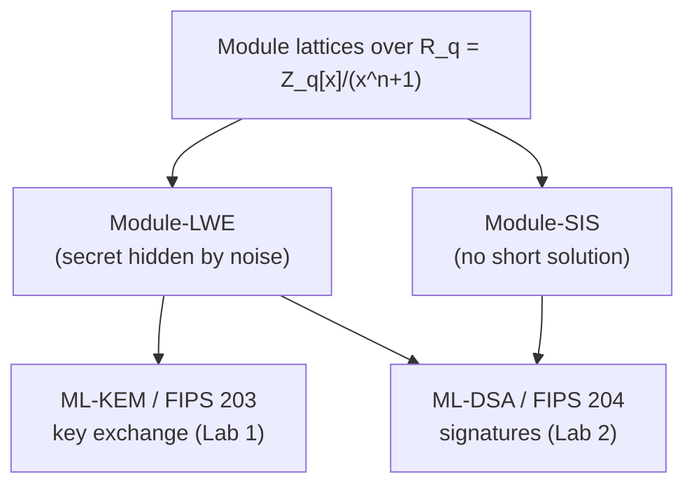
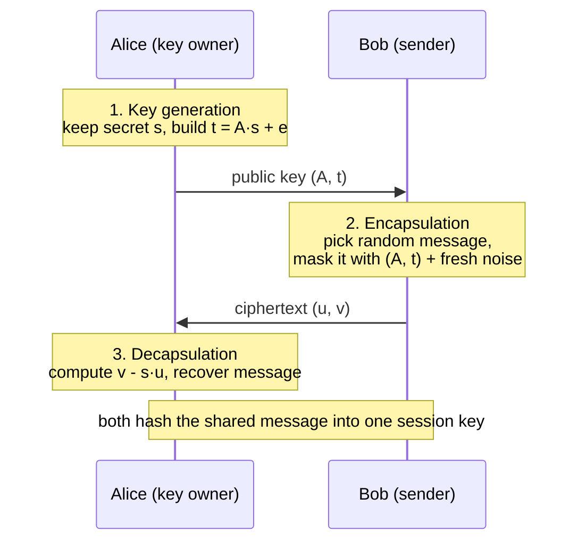

# A Hands-On Module-Lattice Lab

### The One Idea Behind Both ML-KEM and ML-DSA

The companion [key-exchange lab](../ipsec/key-exchange/README.md) makes a VPN's *key exchange* quantum-safe with **ML-KEM**. The [authentication lab](../ipsec/authentication/README.md) makes its *authentication* quantum-safe with **ML-DSA**. Both labs lean on the same "ML-" prefix, which stands for "Module Lattice", and both quietly promise the same thing: "no known quantum attack." This lab is where we cash that check.

This is the **optional deep-dive** behind the other labs: the place to come if you want to understand *why* they're safe rather than just take it on faith. Here's the secret those two labs share: **ML-KEM and ML-DSA stand on the exact same mathematical foundation.** Learn it once, and you understand the security of *both*. No prior crypto-math required: we'll build it from vectors up, in readable Python you run yourself, and finish by launching a *real* lattice attack and watching it hit a wall. The only thing you need installed is **Docker**.

Ready to meet the math a quantum computer can't crack? Let's dig in.

---

## Contents

1. [What are we trying to figure out?](#what-are-we-trying-to-figure-out)
2. [Why should you care?](#why-should-you-care)
3. [From vectors to lattices](#from-vectors-to-lattices)
4. [The hard problem that matters: LWE](#the-hard-problem-that-matters-lwe)
5. [Climbing the ladder: Ring-LWE and Module-LWE](#climbing-the-ladder-ring-lwe-and-module-lwe)
6. [The other half: Module-SIS](#the-other-half-module-sis)
7. [How ML-KEM uses it](#how-ml-kem-uses-it)
8. [How ML-DSA uses it](#how-ml-dsa-uses-it)
9. [Why a quantum computer can't break it](#why-a-quantum-computer-cant-break-it)
10. [Let's get our hands dirty: the lab](#lets-get-our-hands-dirty-the-lab)
11. [Configuration reference](#configuration-reference)
12. [Appendix: why only Alice can decapsulate](#appendix-why-only-alice-can-decapsulate)

---

## What are we trying to figure out?

The question driving this lab: **what *is* a module lattice, why is "the shortest vector problem" so hard that even a quantum computer can't solve it, and how do ML-KEM and ML-DSA turn that hardness into real security?**

By the end of this lab you'll have, with your own hands:

- **Built a lattice** and watched a "bad" basis hide what a "good" basis makes obvious.
- **Seen the magic of noise:** how adding a tiny error term turns trivial linear algebra into a problem nobody knows how to solve efficiently.
- **Implemented a baby ML-KEM** over the same polynomial ring the real thing uses, and watched two peers agree on a shared secret.
- **Run a real lattice attack** and measured the cost exploding as the dimension grows: the concrete reason a cryptographically-relevant quantum computer (CRQC) doesn't rescue the attacker.

---

## Why should you care?

Because this is the *single* foundation under the entire NIST post-quantum lineup that matters most in practice. ML-KEM (FIPS 203, key exchange) and ML-DSA (FIPS 204, signatures) are both "module-lattice-based," and they are the default recommendations for almost everything: TLS, IKEv2, SSH, code signing. Understand module lattices and you've understood *why* the post-quantum internet is built the way it is.



ML-KEM's security rests on **Module-LWE**. ML-DSA's rests on Module-LWE *and* a sibling problem, **Module-SIS**. Both problems live on the same kind of object (a module lattice), and that object is what the rest of this lab unpacks.

---

## From vectors to lattices

Start simple. A **lattice** is the set of *all integer combinations* of a few starting vectors (a **basis**). Take the two vectors `(1,0)` and `(0,1)`: every integer combination lands on a grid point with whole-number coordinates. That grid, `Z²`, is a lattice.

Here's the twist that makes lattices cryptographically interesting: **the same lattice has infinitely many bases.** The vectors `(15,8)` and `(13,7)` generate the *exact same grid* as `(1,0)` and `(0,1)`. Why exactly the same? Write the two new vectors as the rows of a matrix and take its determinant: `15·7 − 8·13 = 105 − 104 = 1`. A determinant of `±1` means the change of basis is *invertible in whole numbers* (you can get back to `(1,0)` and `(0,1)` using only integer steps), so the two bases reach precisely the same set of points, with none gained and none lost. But `(15,8)` and `(13,7)` are a **bad** basis, while `(1,0)` and `(0,1)` are a **good** one. What makes them bad? They are *long* (length about 17, versus length 1 for the unit vectors) and *nearly parallel* (both point up and to the right at almost the same angle), instead of short and perpendicular.

Why does this matter? Two famously hard problems:

- **SVP (Shortest Vector Problem):** find the shortest non-zero vector in the lattice.
- **CVP (Closest Vector Problem):** given an arbitrary point, find the nearest lattice point.

With a **good** basis, both are easy. To solve CVP, you express the target point in terms of the basis vectors and round each coordinate to the nearest whole number; because the vectors are short and perpendicular, that rounded point really is the closest one. And the shortest vectors are essentially the basis vectors themselves, so SVP is sitting right in front of you.

With a **bad** basis, that rounding trick collapses. Since `(15,8)` and `(13,7)` are long and nearly parallel, reaching a point close to your target means *adding large positive and negative multiples of the two that almost cancel out*, and the right combination is no longer the obvious "round each coordinate" answer. You have to search for it. In two dimensions you could still brute-force that search, but the number of plausible integer combinations to try grows *exponentially* with the dimension, so past a few hundred dimensions no known method, classical or quantum, finds the answer in reasonable time. Same lattice, same points; trivial with the good basis, hopeless with the bad one. That gap is the whole game.

And a public key, it turns out, is essentially a **bad basis**: it pins an attacker to the hard version of these problems, while the matching secret lets the legitimate owner sidestep them. The whole field rests on this asymmetry. You'll see it directly in [Exercise 1](#exercise-1-build-a-lattice-good-vs-bad-bases).

---

## The hard problem that matters: LWE

Lattices are the stage; **Learning With Errors (LWE)** is the play. It's the problem ML-KEM and ML-DSA actually reduce to, and it's beautifully simple.

Pick a secret vector `s` and keep it hidden. Choose a random matrix `A`, then compute:

```
b = A·s + e   (mod q)
```

where `e` is a small **error** (or **noise**) vector. Here `q` is a fixed public **modulus**: a number chosen up front as part of the scheme's parameters, so that every value is reduced into the range `0` to `q−1` (it is usually a prime; the real ML-KEM uses `q = 3329`, the value our toy code in the lab will borrow). Now publish the pair `(A, b)`, but **never** `s` itself. The challenge for an attacker: recover the hidden `s` from the public `(A, b)`.

Before going further, it's worth being clear about what `A` is, and what it is *not*: it isn't a lattice. On its own it's just a rectangular grid of random numbers mod `q`, the coefficients of the linear system `A·s ≈ b`. The lattice only shows up later, once an attacker reframes "find `s`" as a search for a short or close vector. At that point `A` is what *defines* the lattice, but the matrix itself is still not one.

With that settled, what does `b` actually look like? Take `A` to be an `m × n` matrix and `s` a vector of length `n`. The product `A·s` is the ordinary matrix-times-vector operation: dot each of `A`'s `m` rows with `s` to get one number per row, which gives a vector of length `m`. Adding the length-`m` error `e` and reducing every entry mod `q` leaves `b` as a plain vector of `m` integers, each between `0` and `q−1`. (Our toy code keeps `A` square, so `m = n`.)

**So where's the lattice from the previous section?** Right here. Take every point you can build as `A·s` (mod `q`) as `s` ranges over all integer vectors; together with the wrap-around multiples of `q`, those points form a lattice, and `A` is a basis for it, just as `(15,8)` and `(13,7)` were a basis for their grid. Watch the roles carefully, because this is where it's easy to get tangled up: `A` is the *basis*, and `s` is the list of *integer coefficients* that selects one particular lattice point. The product `A·s` is "basis times coefficients", i.e. one specific point of the lattice. The equation `b = A·s + e` then says `b` sits just a tiny step `e` off that lattice point. So "recover `s`" becomes "find the lattice point nearest to `b`, then read off its coefficients", which is precisely the **closest-vector problem (CVP)** from before. And the public key hands the attacker only `A`, a *bad* basis for that lattice, which is exactly what makes the CVP hard.

> **Then where's the *good* basis, and is it `s`?** No, `s` is not a basis at all; it's the secret *coordinates*. And the legitimate key holder does **not** secretly own a good basis that it uses to solve CVP. It never solves a lattice problem in the first place: it *generated* `s` itself, so it simply knows the answer. The good-versus-bad-basis story is really about the **attacker**, who is handed the bad basis `A` and no shortcut, and is therefore stuck with a hard CVP. (ML-KEM and ML-DSA keep the small secret `s`, and never publish anything that would need a good basis to undo.) So nothing here is "good basis times bad basis": there's one basis, `A` (bad, public), one coefficient vector, `s` (secret), and one small error, `e`.

So the point in one sentence is: **without the noise it's trivial, with the noise it's intractable.**

- **No noise (`e = 0`):** `b = A·s` is just a system of linear equations. Any schoolchild with [Gaussian elimination](https://en.wikipedia.org/wiki/Gaussian_elimination) (the standard, fast method for solving such systems exactly) recovers `s`. Zero security.
- **With noise:** every equation is *slightly* wrong, by an unknown small amount, so Gaussian elimination just amplifies those errors into garbage. The only known way forward is the CVP attack above: run **[lattice reduction](https://en.wikipedia.org/wiki/Lattice_reduction)**, the family of algorithms that slowly grind a bad basis toward a good one until the nearest lattice point to `b` becomes findable. The catch is cost. Producing a basis good *enough* takes time that grows **exponentially with the dimension** (the number of coordinates in `s`): doubling the dimension does not double the work, it squares it and worse. At a handful of dimensions it is instant; at the hundreds real schemes use, it is hopeless, for classical and quantum machines alike. You'll watch this curve bend out of reach in [Exercise 4](#exercise-4-run-a-real-attack-and-watch-it-stall).

That single addition of `e` is the difference between "homework" and "post-quantum cryptography." You'll break the noise-free version and watch the noisy version defeat the same code in [Exercise 2](#exercise-2-the-magic-of-noise-lwe).

> **Why noise is safe to add.** It might sound strange to you to base encryption on deliberately *wrong* equations. Here's the trick. To hide a message, a scheme buries it under a term like `A·s` that looks like uniform random junk to anyone without the secret: a one-time **mask**. The legitimate user holds a trapdoor (the secret `s`) that lets them recompute that exact masking term and *subtract it back off* ("cancel the mask"), leaving just the message plus the small noise, which then rounds away cleanly, provided the noise stays within a **budget** (below `q/4` in the toy encryption you'll build in [Exercise 2](#exercise-2-the-magic-of-noise-lwe)). Too much noise and even the legitimate user gets the wrong answer (a "decryption failure"). Real ML-KEM tunes its parameters so this budget is essentially never exceeded.

---

## Climbing the ladder: Ring-LWE and Module-LWE

Plain LWE works, but it's heavy: `A` is a big `n×n` matrix of independent random numbers, so keys are large and arithmetic is slow. The fix is to add *structure*, and that comes in three levels:

| Level | What `A`'s entries are | Trade-off |
|------|------------------------|-----------|
| **LWE** | plain integers mod `q` | most conservative, but big keys / slow |
| **Ring-LWE** | elements of one polynomial ring `R_q = Z_q[x]/(x^n+1)` | small, fast (one big ring), but maximum algebraic structure |
| **Module-LWE** | small `k×k` matrices *of ring elements* | the sweet spot: fast ring math, tunable security |

**Ring-LWE** replaces integers with *polynomials* in the ring `R_q = Z_q[x]/(x^n+1)`: degree-`n` polynomials with coefficients mod `q`, where `x^n` wraps around to `-1` (so multiplication is "negacyclic"). One ring element packs `n` numbers, multiplication is fast (it can use the [Number-Theoretic Transform](https://en.wikipedia.org/wiki/Discrete_Fourier_transform_over_a_ring#Number-theoretic_transform)), and keys shrink dramatically. The slight worry: all that extra algebraic structure *might* one day give an attacker a foothold (none is known, but in cryptography conservatism is wise).

> **Background: what is a polynomial ring?** A **ring** is just a number system where you can add, subtract, and multiply and always land back inside the system (division is not required). The plain integers are a ring; so are the integers mod `q`. A **polynomial ring** is what you get when the "numbers" are polynomials. Let's unpack `Z_q[x]/(x^n+1)` one symbol at a time:
>
> - **`Z_q`**: the coefficients live in the integers mod `q` (e.g. `0..q-1`). Every number wraps around at `q`, exactly like a clock face.
> - **`Z_q[x]`**: all polynomials in a variable `x` whose coefficients come from `Z_q`, things like `3 + 5x + 2x^2`. You add and multiply them the ordinary way, reducing coefficients mod `q`.
> - **`/(x^n+1)`**: the "quotient" part. It says *work modulo the polynomial `x^n+1`*. This is the exact same idea as ordinary "mod" arithmetic on integers, just with a polynomial instead of a number. Recall that "mod `q`" means you treat `q` as `0`: whenever a `q` shows up, you replace it with `0` and only keep what's left over. Here, "mod `x^n+1`" means you treat the whole polynomial `x^n+1` as `0`. And if `x^n + 1 = 0`, then rearranging gives `x^n = -1`. So the rule "mod `x^n+1`" is just a compact way of saying "every time you see `x^n`, replace it with `-1`." Any time a product pushes the degree up to `x^n` or beyond, you fold it back down: `x^n` becomes `-1`, `x^{n+1}` becomes `-x`, and so on. This keeps every element pinned to degree below `n`.
>
> The payoff: an element of `R_q` is nothing more exotic than a list of `n` coefficients `(a_0, a_1, ..., a_{n-1})`, i.e. **a vector of `n` numbers mod `q`**. Addition is coordinate-wise; multiplication is polynomial multiplication followed by the `x^n = -1` wraparound (a "negacyclic convolution"). So when ML-KEM talks about a "vector of ring elements," picture a short stack of these `n`-number blocks. You'll manipulate them directly in [Exercise 3](#exercise-3-build-a-baby-ml-kem).
>
> **A worked example.** Take the tiny ring `Z_17[x]/(x^4+1)`: coefficients mod `17`, polynomials of degree below `4` (so every element is just 4 numbers), and the rule `x^4 = -1`. Let `a = 1 + 2x` (the vector `(1, 2, 0, 0)`) and `b = 3 + 4x^3` (the vector `(3, 0, 0, 4)`).
>
> - **Add** (coordinate-wise, no wraparound of `x`): `a + b = 4 + 2x + 4x^3 = (4, 2, 0, 4)`.
> - **Subtract** (coordinate-wise, then reduce mod `17`): `a - b = -2 + 2x - 4x^3 = (15, 2, 0, 13)`.
> - **Multiply** (this is where the ring "wraps"): expand normally first,
>   ```
>   (1 + 2x)(3 + 4x^3) = 3 + 6x + 4x^3 + 8x^4
>   ```
>   The `8x^4` term has degree 4, too high to keep. Apply `x^4 = -1`, so `8x^4` becomes `-8`:
>   ```
>   = (3 - 8) + 6x + 4x^3 = -5 + 6x + 4x^3  =  (12, 6, 0, 4)  (mod 17)
>   ```
>   That fold-back is what keeps the result a 4-coefficient element instead of growing without bound. (Ordinary "cyclic" rings use `x^n = +1`; the `-1` here is why this flavor is called *negacyclic*. Add and subtract never trigger it; only multiplication can push the degree to `n` or higher.)
>
> **Why this is fast.** Done the direct way, that multiply costs `n²` coefficient products (every term times every term). The [Number-Theoretic Transform](https://en.wikipedia.org/wiki/Discrete_Fourier_transform_over_a_ring#Number-theoretic_transform) is an exact, integer-only cousin of the FFT: transform both operands, multiply them **coordinate-wise** (`n` cheap products), then transform back, for a total cost of about `n·log(n)` instead of `n²`. At ML-KEM's `n = 256` that is the difference between ~65,000 and ~2,000 multiplications per ring product, which is why real schemes pick a `q` that makes the NTT available.

**Module-LWE** is what ML-KEM and ML-DSA actually use. Instead of one giant ring element (Ring-LWE) or `n²` lonely integers (LWE), you build small **vectors and matrices whose entries are ring elements**. The "module rank" `k` is how many ring elements you stack. This gives you:

- **Ring-LWE's speed**, because the underlying arithmetic is still the fast ring `R_q`.
- **LWE-like tunability**, because you dial security up or down just by changing `k` *without touching the ring*.

That last point is the punchline you'll prove in [Exercise 3](#exercise-3-build-a-baby-ml-kem): **ML-KEM-512, -768, and -1024 are the same ring (`n=256, q=3329`) with `k = 2, 3, 4`.** The only thing that changes between security levels is how many ring elements you stack. A "module lattice" is exactly the lattice you get when you write out one of these module equations over the integers.

---

## The other half: Module-SIS

LWE has a twin: the **Short Integer Solution (SIS)** problem. Where LWE asks "find the *hidden secret*," SIS asks "find a *short solution* to a random linear system":

```
Given a random A, find a short, non-zero z with   A·z = 0   (mod q)
```

Finding *some* `z` is easy (linear algebra); finding a **short** one is hard: it's an SVP-flavored lattice problem again. In **module** form (entries are ring elements) it becomes **Module-SIS (MSIS)**.

Why introduce it? Because signatures need it. Roughly: **MLWE hides the signing key, and MSIS makes forgery hard**: a forger would have to produce a short solution to a random system, i.e. solve MSIS. ML-DSA leans on both. That's the whole reason this lab covers both problems: ML-KEM needs one, ML-DSA needs both, and they're two faces of the same lattice hardness.

---

## How ML-KEM uses it

ML-KEM (FIPS 203) is Module-LWE dressed up as a **key-encapsulation mechanism (KEM)**: a way for two parties who have never met to agree on a shared secret. Underneath, it's the same mask-and-cancel trick from the LWE section, with the public key doing the masking.

The whole exchange is a quick round trip between two parties, **Alice** and **Bob**: Alice publishes a public key, Bob uses it to lock a fresh **random value** into a ciphertext and sends that to Alice, and Alice unlocks it with her private key. That value isn't a real message, it's random on purpose: its only job is to leave both ends holding the *same* secret bits, which they then hash into the key they'll use from then on. Here are those three steps in detail, all of which you'll build in [Exercise 3](#exercise-3-build-a-baby-ml-kem):

1. **Key generation.** Alice publishes a Module-LWE sample as her public key: the random matrix `A` together with a value that hides a short secret `s` under noise (that value is the same `b = A·s + e` shape from before, just renamed `t`). Everyone can see the public key, but only Alice can recover `s`, because digging it back out *is* the hard MLWE problem.
2. **Encapsulation.** Bob generates a random value he wants to share (the *message*, the cargo) and uses it to create a brand-new Module-LWE sample, built from Alice's public key. He mirrors exactly what Alice did in step 1: he reuses the *same* matrix `A` from her public key, and draws his own short randomness `r` to play the role her secret `s` played, so his sample `A·r + e1` has the identical `A·s + e` shape as `t`. That `r` plus a little fresh noise is the one-time scrambling material of Bob's own, whose only job is to mask the message (the packaging). The result is the *ciphertext*, and that scrambling noise is exactly what protects it: it makes the ciphertext a genuine, hard LWE instance, so on the wire it looks like pure random and the message stays buried, held there by the same LWE hardness that hides `s` in the public key. Bob needs only the public key for all this.
3. **Decapsulation.** Alice uses `s` to cancel the mask and is left with the message plus a little leftover noise. As long as that noise stays under the `q/4` budget, it rounds away cleanly and the message pops back out. (For exactly why `s` lets Alice do this while an eavesdropper holding the same public key cannot, see the [appendix](#appendix-why-only-alice-can-decapsulate).)

The round trip at a glance:



Those chunky ML-KEM public keys and ciphertexts that fragment across `IKE_INTERMEDIATE` in the IKEv2 key-exchange lab are precisely the public key and ciphertext from steps 1 and 2 going over the wire.

---

## How ML-DSA uses it

ML-DSA (FIPS 204) is a **signature scheme**, so its job is different: let Alice, the key's owner, prove to Bob (or anyone) that a message really came from her, without ever exposing the key. Alice signs; Bob verifies. It uses the same module lattice, but in a *commit, challenge, respond* pattern (the **Fiat–Shamir** recipe), and this is where **both** MLWE and MSIS come in:

1. **Keys.** The public key is, again, a Module-LWE sample hiding a short secret under noise. Same trick, same hardness as ML-KEM's key.
2. **Signing.** This is the heart of Fiat–Shamir, and it plays out in three moves:
   - **Commit.** Alice picks a fresh random *masking value* and publishes only a scrambled version of it (the *commitment*). Think of it as sealing a random guess in an envelope: it locks in her choice while giving nothing away about it.
   - **Challenge.** The message is hashed together with that commitment to produce a small *challenge* value. Since it falls out of a hash of both, Alice can't hand-pick it, and it ties the signature to this exact message: change one byte of the message and the challenge changes.
   - **Respond.** Alice's *response* combines the masking value with her secret scaled by the challenge (roughly `response = mask + challenge·secret`). The mask is what keeps the secret hidden, while the challenge is what forces the secret to take part, so the response proves she knows the secret without revealing it.

   The response can be checked for consistency against the public key and commitment, yet on its own it doesn't hand over the secret.
3. **The catch: rejection sampling.** A response built the obvious way would still leak a faint trace of the secret. So ML-DSA throws away any response that could leak and retries until it draws a clean one ("Fiat–Shamir with aborts"), so the signature reveals nothing about the key.
4. **Verification.** This is where Bob comes in: he (or in fact anyone, since the signature is public) takes Alice's public key, recomputes the relation, checks it lines up with the commitment, and confirms the response is *short*. A valid check convinces Bob the message really came from Alice.

The security splits cleanly in two: the secret key stays hidden thanks to **MLWE**, and forging a signature without the key would mean finding a short solution to a random system, which is exactly the **MSIS** problem. The enormous ML-DSA certificates and signatures that blow `IKE_AUTH` up to six fragments in the authentication lab are these public-key and signature values.

> **What we actually build below:** the hands-on exercises take the *KEM* side (ML-KEM / Module-LWE) all the way to a working shared secret, because that's the cleanest way to watch a module lattice do real work. Module-SIS and the full ML-DSA signature stay on paper here. If you want to see ML-DSA actually sign and verify, that's the job of the [IKEv2](../ipsec/authentication/README.md) and [TLS](../tls/authentication/README.md) authentication labs.

> **One foundation, two jobs.** ML-KEM = MLWE → encryption/KEM. ML-DSA = MLWE (hide key) + MSIS (block forgery) → signatures. Different costumes, same module-lattice hardness underneath. That's why a single lab can explain both.

---

## Why a quantum computer can't break it

This is the question every PQC discussion circles back to. RSA and elliptic curves *die* to a quantum computer, so why do these survive? Three reasons, and you'll watch the third one happen in [Exercise 4](#exercise-4-run-a-real-attack-and-watch-it-stall).

### 1. Shor's algorithm simply doesn't apply

Shor's algorithm, the quantum bomb that breaks RSA and ECC, isn't a generic "solve hard math" machine. It solves one specific thing astonishingly well: the **abelian hidden subgroup problem (HSP)**, which is the abstract pattern behind *factoring* and *discrete logarithms*. Both boil down to finding a hidden **period** in a function over a commutative group, and the quantum Fourier transform finds periods almost for free.

Lattice problems have **no such periodic structure**. The closest anyone has tied SVP/LWE to is the *dihedral* (non-abelian) HSP, and despite 20+ years of effort, there is **no known efficient quantum algorithm** for the dihedral HSP. Shor's machinery has no foothold. This is the deep reason lattices were chosen.

### 2. Grover's algorithm only halves the exponent

The other famous quantum tool, Grover's search, speeds up *brute force*, but only quadratically: a `2^k` search becomes `2^(k/2)`. That's real, but it's not catastrophic, and NIST already prices it in. Security levels are *defined* so that even a Grover-equipped adversary stays above the bar (this is why ML-KEM-768 targets a level comfortably above the symmetric-key line). Quadratic is not exponential.

### 3. The best attack stays exponential, even quantumly

The genuinely best known attack on LWE/MLWE, classical or quantum, is **lattice reduction** (BKZ), whose engine is solving SVP in a "block" via **sieving**. Its cost is exponential in the block size `b`, and `b` must grow with the lattice dimension. Quantum sieving helps only at the margin:

| Sieve | Cost (in the block size `b`) |
|-------|------------------------------|
| Best classical | ~`2^(0.292·b)` |
| Best known quantum | ~`2^(0.265·b)` (some estimates ~`2^(0.257·b)`) |

A smaller constant in the exponent, but **still exponential**. Shaving a sliver off an exploding curve leaves it exploding. NIST's parameters carry margin precisely for this.

> **The bottom line:** every quantum tool we know either *doesn't apply* (Shor), *only square-roots* the work (Grover), or *barely dents the exponent* (quantum sieving). The exponential wall you'll watch rise in [Exercise 4](#exercise-4-run-a-real-attack-and-watch-it-stall) is what a CRQC runs into, and can't climb.

---

## Let's get our hands dirty: the lab

Enough theory: let's run it. Everything here runs **locally on your own workstation** inside one tiny throwaway Docker container with Python, `numpy`, and `fpylll` (a real lattice-reduction library). Four exercises, each a script you run and can edit:

- **[Exercise 1](#exercise-1-build-a-lattice-good-vs-bad-bases)**: build a lattice, feel the good-vs-bad-basis gap, and watch LLL reduce one.
- **[Exercise 2](#exercise-2-the-magic-of-noise-lwe)**: break noise-free LWE with linear algebra, then watch noise defeat it.
- **[Exercise 3](#exercise-3-build-a-baby-ml-kem)**: implement a mini Module-LWE KEM over the real ring and agree on a shared secret.
- **[Exercise 4](#exercise-4-run-a-real-attack-and-watch-it-stall)**: launch a real lattice attack and measure the cost exploding.

### Prerequisites

Just **Docker**, with the Compose v2 plugin (the `docker compose` subcommand, not the old standalone `docker-compose`). Everything else, Python, `numpy`, and `fpylll`, lives inside the container. No prior crypto-math needed, though if you are comfortable with vectors and "mod q" arithmetic you will move through it faster.

### Build and start

Run all commands in this lab from the `module-lattices/` directory:

```bash
cd module-lattices
```

```bash
# Build the lab image (quick, just installs Python + numpy + fpylll)
docker compose build

# Start the container in the background
docker compose up -d

# Confirm it's up
docker compose ps
```

The `scripts/` directory is mounted into the container at `/lab`, so you can edit the scripts on your workstation and rerun instantly. Run each exercise with `docker exec`, like for example:

```bash
docker exec lattice-lab python3 lattice_basics.py
```

(Prefer an interactive shell? `docker exec -it lattice-lab bash` drops you into `/lab`, where `vim` is available for tinkering.)

---

### Exercise 1: Build a lattice, good vs bad bases

```bash
docker exec lattice-lab python3 lattice_basics.py
```

**Part A** shows two bases for the *same* lattice: one good, one bad:

```
good basis : [[1, 0], [0, 1]]
bad  basis : [[15, 8], [13, 7]]
det(good)  = 1
det(bad)   = 1   (equal magnitude -> same lattice)
Hadamard ratio  good = 1.0000   bad = 0.0631   (closer to 1 is better)
Shortest basis vector  good = 1.00   bad = 14.76
```

Both have determinant 1, so they generate the *identical* grid of points, but the "Hadamard ratio" (a measure of how close to perpendicular the vectors are: 1.0 is perfectly perpendicular, near 0 means they are nearly parallel) makes the difference obvious. The bad basis's shortest vector is ~15× longer than the good one's. A public key hands an attacker exactly this kind of bad basis.

**LLL** (Lenstra, Lenstra, and Lovász) is the classic **lattice-reduction** algorithm: hand it a long, nearly-parallel basis and it returns a shorter, more perpendicular basis for the *exact same* lattice, and it does so in polynomial (fast) time. It's the workhorse every lattice attack opens with, turning a bad basis into a usable one before anything harder is tried. Its stronger but far slower cousin is **BKZ** (Block Korkine–Zolotarev), which takes over when LLL's result isn't good enough (you'll put both to work in [Exercise 4](#exercise-4-run-a-real-attack-and-watch-it-stall)).

**Part B** runs LLL on the bad basis and recovers a good one:

```
LLL-reduced basis : [[-1, 0], [0, -1]]
Hadamard ratio after LLL = 1.0000
Shortest vector after LLL = 1.00
```

LLL turned the long, nearly-parallel basis straight back into the unit vectors (up to sign). In 2-D, reduction is trivial, which is the setup for the bad news in **Part C**:

```
   dimension d =    2: LLL may be off by up to 2^0.5
   dimension d =   50: LLL may be off by up to 2^24.5
   dimension d =  256: LLL may be off by up to 2^127.5
   dimension d =  768: LLL may be off by up to 2^383.5
```

Each row is LLL's **worst-case approximation factor**, `2^((d-1)/2)`, where `d` is the lattice dimension. Read it as a *length ratio*: the vector LLL promises to hand back can be up to that many times longer than the true shortest vector. At `d = 2` the factor is `2^0.5 ≈ 1.41`, so the vector you get is basically the real shortest one. At `d = 50` it's already `2^24.5` (about 24 million), and at `d = 768` (ML-KEM-768's secret dimension) it grows to `2^383.5`, a number with over a hundred digits, so LLL only guarantees a vector far longer than the one you actually want. The promise has gone from "good enough" to useless.

This is a *worst-case* bound, and LLL often does better in practice, but the guarantee is what breaks down, and past a few dozen dimensions you can no longer count on it. LLL itself stays fast (polynomial time); only its *quality* gives out. Closing that gap, actually finding the short vector, means running BKZ with large block sizes (windows of many basis vectors at once), whose cost is itself exponential in the block size. Hold that thought for [Exercise 4](#exercise-4-run-a-real-attack-and-watch-it-stall).

---

### Exercise 2: The magic of noise (LWE)

```bash
docker exec lattice-lab python3 toy_lwe.py
```

**Part A**: noise-free LWE is just linear algebra, and the script solves it exactly:

```
secret s          : [3306, 39, 323, 640, 3225, 2303, 2935, 667]
recovered (no e)  : [3306, 39, 323, 640, 3225, 2303, 2935, 667]
match             : True
-> With e = 0, anyone who sees (A, b) just solves for s. No security.
```

**Part B**: add a tiny error vector (each entry is a small whole number from -2 to 2, the same noise range real ML-KEM-768 uses, set by its `η = 2` parameter in the [config table](#ml-kem-parameter-sets-fips-203)) and run the *exact same* Gaussian elimination:

```
error e added     : [1, -1, 0, -2, 1, 2, 1, -2]
recovered (with e): [3262, 747, 1459, 1817, 650, 1873, 3199, 111]
secret s          : [3306, 39, 323, 640, 3225, 2303, 2935, 667]
difference        : [-44, 708, 1136, 1177, 754, -430, 264, -556]
```

A handful of `±2` nudges and the recovered "secret" is total garbage. The noise propagates through elimination and explodes. *This* is the LWE hardness, and no efficient classical or quantum algorithm is known to undo it at real dimensions.

**Part C** builds a tiny Regev-style bit encryption and shows the **noise budget**. With a healthy budget the bits round-trip perfectly; crank the noise past `q/4` and decryption starts flipping bits:

```
Encrypting the bits [1, 0, 1, 1, 0] with a healthy noise budget:
   sent     = [1, 0, 1, 1, 0]
   recovered= [1, 0, 1, 1, 0]   correct = True

Now crank the per-ciphertext noise way past the q/4 budget:
   sent     = [1, 0, 1, 1, 0]
   recovered= [1, 0, 1, 0, 0]   correct = False
```

Where does that `q/4` cutoff come from? Here is the whole idea, step by step.

Picture the numbers `0, 1, 2, ..., q-1` as positions around a **clock face** with `q = 3329` marks on it (the same "mod q" clock from earlier). To hide one bit, the scheme parks it at one of just two spots on that clock:

- a **0-bit** stays at position `0`,
- a **1-bit** is placed at the halfway mark, `q/2 = 1664`.

Encryption then sprinkles a little random **noise** on top, so the value you actually send lands *near* `0` or *near* `1664`, but rarely exactly on the mark. Decryption uses the secret `s` to strip away the mask, leaving you with that noisy position: something like "`0` plus a small nudge" or "`1664` plus a small nudge".

To read the bit back, you ask one question: **is this value closer to `0` or closer to `1664`?** The tipping point sits exactly halfway between the two marks, at `q/4 = 832`:

```
0                    q/4 = 832               q/2 = 1664
|-----------------------|-----------------------|
   rounds to 0 (bit 0)      rounds to q/2 (bit 1)
```

So the **noise budget is `q/4`**. As long as the total noise is smaller than `832`, every value stays on the correct side of that line and the bit decodes perfectly. Push the noise past `832` and a value can jump the line, land closer to the *wrong* mark, and the bit flips. (Why `q/4` and not some other number? The two marks are `q/2` apart, and rounding to the nearer one tolerates up to *half* that distance in either direction. Half of `q/2` is `q/4`.)

That is exactly what the two runs show. In the healthy run the noise is only a few units, tiny next to `832`, so all five bits round-trip. In the overshoot run the noise is cranked past `832`, so one value crosses the boundary and its bit flips (`sent 1`, `recovered 0`).

That tension, *enough* noise to hide the secret but *little enough* to decrypt reliably, is the tightrope every lattice scheme walks. ML-KEM's parameters are chosen so the "decryption failure" probability is astronomically small.

---

### Exercise 3: Build a baby ML-KEM

```bash
docker exec lattice-lab python3 baby_kyber.py
```

A working **Module-LWE key encapsulation mechanism** in miniature, over the *same ring* ML-KEM uses (`R_q = Z_q[x]/(x^n+1)` with `q = 3329`), just with toy sizes (`n=16, k=2`).

**Part A** encrypts and decrypts a message, reporting the actual noise:

```
PART A - encrypt / decrypt a message
   message  : [0, 0, 0, 1, 0, 0, 0, 0, 0, 0, 1, 1, 0, 1, 1, 1]
   recovered: [0, 0, 0, 1, 0, 0, 0, 0, 0, 0, 1, 1, 0, 1, 1, 1]
   match    : True
   peak decryption noise = 15  (must stay < q/4 = 832)
```

The secret `s` is the trapdoor: only it cancels the `A·r` mask, leaving message + small noise (peak 15, comfortably under the 832 budget) that rounds back cleanly: the same mechanism from [Exercise 2](#exercise-2-the-magic-of-noise-lwe), now over polynomials.

**Part B** runs it as an actual KEM: both peers derive the same shared key:

```
PART B - key encapsulation (the actual ML-KEM job)
   encapsulated shared secret : 256e41b497074a6ff5e6921c189c443c...
   decapsulated shared secret : 256e41b497074a6ff5e6921c189c443c...
   secrets agree              : True
```

And the closing table nails the whole point of "module":

```
   toy here        real ML-KEM-768
   n  = 16          n  = 256        (ring degree, SAME for all sizes)
   q  = 3329        q  = 3329       (SAME prime modulus)
   k  = 2           k  = 3          (module rank: bumps security level)
   The ONLY structural difference between ML-KEM-512/768/1024 is k=2/3/4.
```

Notice `n` appears twice at different values, and it's worth pinning down why. The toy shrinks `n` to `16` purely so everything stays small enough to read and run by hand, while real ML-KEM uses `n = 256`. That shrink is a *toy-versus-real* simplification, not a security setting. The table's bottom line makes the sharper point: across the three shipping sizes (ML-KEM-512, -768, and -1024) the ring never changes at all (`n = 256` and `q = 3329` for all three), and the only thing that moves between those security levels is the module rank `k = 2/3/4`. One ring, one set of arithmetic, security dialed purely by how many ring elements you stack. That's what made module lattices win.

> **Tinker with it.** Open `scripts/baby_kyber.py`, bump `K` to 3 or 4 (the real ML-KEM-768/1024 ranks), or shrink `N`, and rerun. Watch the public key grow with `k` while decryption keeps working.

---

### Exercise 4: Run a real attack and watch it stall

```bash
docker exec lattice-lab python3 attack_scaling.py
```

Now we *attack* LWE for real. The script builds genuine LWE instances, embeds each as a "unique shortest vector" problem (the standard **primal** attack), and unleashes `fpylll`'s LLL and BKZ on it, timing each as the dimension climbs:

(You'll notice the header says `q=97`, not the `3329` from the baby-Kyber lab. That's deliberate: a small modulus and tiny ternary secrets keep the embedded lattice loose enough that the reductions actually finish on a laptop. The point here is the *scaling* of the effort as `n` grows, not the specific modulus.)

```
LWE dim n | lattice dim |  solved? |       effort |  time (s)
------------------------------------------------------------------------
       20 |          41 |     True |          LLL |      0.01
       30 |          61 |     True |          LLL |      0.01
       40 |          81 |     True |          LLL |      0.03
       50 |         101 |     True |       BKZ-20 |      1.62
       60 |         121 |     True |       BKZ-20 |      3.54
```

(Your exact times will differ, but the *shape* won't.) The small instances fall instantly to cheap, polynomial-time LLL. Then, right around `n = 50` here, LLL **stalls**, BKZ has to take over, and the clock starts climbing fast, because BKZ's cost is exponential in its block size. That inflection is the exponential wall coming into view.

The script then extrapolates to real parameters (where the attack lattice has dimension ~1500+, the required BKZ block size runs into the *hundreds*, and the cost blows past `2^150`) and closes with the three reasons a CRQC doesn't help:

```
WHY A CRYPTOGRAPHICALLY-RELEVANT QUANTUM COMPUTER (CRQC) DOES NOT HELP

1. SHOR DOES NOT APPLY.        (no periodic / abelian-HSP structure to exploit)
2. GROVER ONLY HALVES THE EXPONENT.   (quadratic speedup, already priced in)
3. QUANTUM SIEVING SHAVES A CONSTANT, NOT THE CURVE.  (2^0.292b -> 2^0.265b)
```

You just watched, in wall-clock seconds, the thing the theory promised: the cost of breaking a lattice explodes with dimension, and no known quantum trick changes that verdict. *That's* why ML-KEM and ML-DSA are safe.

> **Push it further.** Edit `scripts/attack_scaling.py` and add `70` or `80` to the dimension loop, but be ready to wait. Each step up the dimension is a step up the exponential. That impatience you feel is the security.

---

### Cleanup

```bash
docker compose down
```

That stops and removes the container. The built image is kept, so the next `docker compose up -d` is instant. The scripts live in your clone, untouched.

And that's the foundation! You built a lattice, watched noise turn easy math into hard math, implemented a baby ML-KEM over the real ring, and ran an honest lattice attack into the exponential wall that protects every module-lattice scheme. The next time the [key-exchange](../ipsec/key-exchange/README.md) or [authentication](../ipsec/authentication/README.md) lab says "module-lattice-based" and "no known quantum attack," you'll know *exactly* what's holding the line. Nicely done!

---

## Configuration reference

### The shared ring

Both ML-KEM and ML-DSA work over `R_q = Z_q[x]/(x^n+1)` with the **same ring degree `n = 256`**. They differ in the modulus `q` and in how many ring elements they stack (the module dimensions):

| Scheme | `n` | `q` | Underlying problems |
|--------|-----|-----|---------------------|
| ML-KEM (FIPS 203) | 256 | 3329 | Module-LWE |
| ML-DSA (FIPS 204) | 256 | 8380417 (`2²³ − 2¹³ + 1`) | Module-LWE + Module-SIS |

### ML-KEM parameter sets (FIPS 203)

| Parameter set | NIST level | Module rank `k` | `η₁` / `η₂` | Public key | Ciphertext |
|---------------|-----------|-----------------|-------------|-----------|-----------|
| ML-KEM-512 | 1 | 2 | 3 / 2 | 800 B | 768 B |
| **ML-KEM-768** | **3** | **3** | **2 / 2** | **1184 B** | **1088 B** |
| ML-KEM-1024 | 5 | 4 | 2 / 2 | 1568 B | 1568 B |

The only structural knob across the three is the module rank `k = 2/3/4`. Bigger `k` → a taller Module-LWE instance → a higher-dimensional lattice → more security (and bigger keys). ML-KEM-768 is the recommended default, the same one the [key-exchange lab](../ipsec/key-exchange/README.md) negotiates.

### ML-DSA parameter sets (FIPS 204)

| Parameter set | NIST level | `(k, ℓ)` | `η` | Public key | Signature |
|---------------|-----------|----------|-----|-----------|-----------|
| ML-DSA-44 | 2 | (4, 4) | 2 | 1312 B | 2420 B |
| **ML-DSA-65** | **3** | **(6, 5)** | **4** | **1952 B** | **3309 B** |
| ML-DSA-87 | 5 | (8, 7) | 2 | 2592 B | 4627 B |

Here the module dimensions `(k, ℓ)` set both the MLWE key-hiding hardness and the MSIS forgery hardness. ML-DSA-65 is the general-purpose default, the family the [authentication lab](../ipsec/authentication/README.md) generates certificates from.

---

## Appendix: why only Alice can decapsulate

A fair question about [step 2](#how-ml-kem-uses-it): Bob builds the ciphertext with nothing but Alice's *public* key, so why can't an eavesdropper holding that same public key just unmask the message the way Alice does? The answer is that Alice holds one extra thing, the secret `s`, and that single value is what makes the mask fall away. Here is the mechanism in full.

Write the public key as the matrix `A` and the value `t = A·s + e`, with `s` Alice's short secret and `e` small noise. To encapsulate, Bob draws his own short randomness `r` and small noise `e1`, `e2`, and produces the ciphertext `(u, v)`:

```
u = A·r + e1
v = t·r + e2 + encode(message)
```

**Why two pieces, `u` and `v`?** The message lives in `v`, buried under the masking term `t·r`. Removing that mask is the whole game, but it needs `r`, and only Bob knows `r`. If Bob sent `v` alone, Alice would be stuck: `t` is her own public value, yet without `r` she has no way to rebuild `t·r`, so the message would stay buried even for her. Bob can't simply hand over `r` either, because anyone who learns `r` can unmask the message and the noise guarding `u` would be pointless. That is exactly what `u` is for: it carries `r`'s contribution *through the same `A`*, so that Alice's secret `s`, which only ever bites on things multiplied by `A`, can regenerate the mask indirectly. So the two halves have distinct, non-interchangeable jobs: `v` is the payload wearing the mask, and `u` is the one thing that lets `s` recompute that mask. Neither works alone.

**What Alice does.** Alice computes `v - s·u`. Substitute `t = A·s + e` and watch the large term cancel:

```
v       = t·r + e2 + encode(message)
        = (A·s + e)·r + e2 + encode(message)
        = s·A·r + e·r + e2 + encode(message)

s·u     = s·(A·r + e1)
        = s·A·r + s·e1

v - s·u = encode(message) + (e·r + e2 - s·e1)
```

The big `s·A·r` term shows up in both `v` and `s·u`, so it subtracts away and vanishes. What's left is `encode(message)` plus a leftover `e·r + e2 - s·e1`. Every piece of that leftover (`e`, `r`, `e1`, `e2`, `s`) is *short*, so the leftover is tiny, well under the `q/4` budget, and it rounds off cleanly. The message pops back out.

The trick is that `s` lets Alice rebuild the exact mask `t·r` straight from the public `u` (because `s·u` is approximately `(A·s)·r`, which is approximately `t·r`), and then cancel it. `s` is the only value that forms this bridge between `A` and `t`.

Seen from a distance this is Diffie–Hellman with noise: both sides quietly converge on the same shared value `(A·s)·r`. Bob reaches it as `t·r` (he holds `r` and multiplies by the public `t`); Alice reaches it as `s·u` (she holds `s` and multiplies by Bob's `u`). Neither party can get there from their own secret alone, which is precisely why the exchange needs one public message travelling each way: `t` (inside Alice's public key) going out, and `u` coming back. That symmetry is the same reason both `u` and `v` have to be sent.

**Why an eavesdropper is stuck.** A man-in-the-middle sees `A`, `t`, `u`, and `v`, everything except `s`. To strip the mask off `v` they would need either:

- **Bob's `r`**, but recovering `r` from `u = A·r + e1` is itself an LWE problem (a noisy sample, recover the secret), or
- **Alice's `s`**, but recovering `s` from `t = A·s + e` is also an LWE problem.

Both roads are the same hard lattice problem this whole lab is about, and the added noise (`e1` here, `e` in the key) is exactly what blocks the shortcut: try to invert `A` directly and the noise blows up into garbage, the same collapse you watched in [Exercise 2](#exercise-2-the-magic-of-noise-lwe).

So the asymmetry is the point of public-key crypto: the public key is enough to *lock* a message (encapsulate), but only the private key `s` can *unlock* one (decapsulate), and finding `s` from public values is infeasible.

> **A note on the errors.** The noise terms never help anyone decrypt. They are the price of security: they turn `u` and `t` into hard LWE samples, and they survive decapsulation as the small leftover `e·r + e2 - s·e1` that rounds away. The thing that actually opens the ciphertext is `s`, nothing else.
